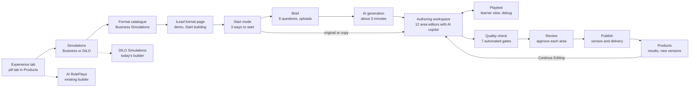

# GenieKreator Authoring Screens: iLead Business Simulation

> Source of truth: https://claude.ai/code/artifact/b2ed651d-d91d-4869-877d-680e4bb5c3f0 (Claude Doc, exported 2026-10-01). Doc priority: 1 (highest). This file is a verbatim markdown export for search and review; if it ever disagrees with the live doc, the live doc wins. Do not edit by hand.

2026-10-01 · @Manu Nair

## Summary

An author reaches iLead in 4 clicks: Experience, then Simulations, then Business Simulations, then the iLead card. From there, 14 new screens and 12 area editors take them from a brief to a published simulation: a short brief, AI generation, one authoring workspace with 12 area editors, then playtest, quality check, review and publish. The screens extend the current GenieKreator patterns: dark theme, breadcrumb, pill tabs for Evaluate, Educate, Experience and Enable, illustrated choice cards with an author perspective line, and the Products list with progress, Continue Editing and Preview.

**Navigation path**

| Level | Screen | What changes from today |
|---|---|---|
| 1 | Home, "What do you want to build?" | No change |
| 2 | Experience tab: Simulations and AI RolePlays cards | No change |
| 3 | Simulations: Business Simulations and DILO Simulations cards | New level. Today's "Create New Simulations" builder becomes Day in the Life (DILO) Simulations |
| 4 | Business Simulations catalogue: theme cards, one is iLead | New |
| 5 | iLead template page and start mode | New; the authoring journey starts here |

**Business vs DILO****, as authors will see it**

|  | Business Simulations | Day in the Life (DILO) Simulations |
|---|---|---|
| Card line | Run a team or business over several weeks, with targets, people and events | Build one day in a role, around the moments and decisions that matter |
| Built from | A KNOLSKAPE engine template such as iLead | A blank scenario (today's builder) |
| Length for learners | 30 to 105 minutes, multiple weeks | 10 to 30 minutes |
| Existing products (to confirm) | None yet | Team Engage, Fortius Altius |

## Journey flow

The journey has three parts: navigate to the iLead format, create a draft, then refine, check and publish from one workspace. Dashed boxes are existing builders that stay as they are.

_Diagram reconstructed as Mermaid from the drawing embedded in the source doc. Labels are verbatim._


_Caption: author journey, navigation to publish. Dashed boxes are existing builders that stay as they are._

Playtest opens from the workspace at any time; Products links back to the same workspace through Continue Editing.

## Entry screens

**E1. Experience tab (existing, no change)**

Pill tab Experience selected; two illustrated cards: Simulations ("Build immersive simulations") and AI RolePlays ("Create realistic AI conversations here"). Products list below, filtered to Experience.

**E2. Simulations: choose a type (new)**

| Element | Detail |
|---|---|
| Breadcrumb | Home > KNOLSKAPE > Products > Simulations |
| Pill tabs | Same 4 pills, Experience still selected, so the author knows where they are |
| Headline | "What kind of simulation do you want to build?" |
| Card 1 | Business Simulations. Illustration of a team board. Line: "Run a team or business over several weeks, with targets, people and events" |
| Card 2 | Day in the Life (DILO) Simulations. Illustration matching today's Create New Simulations art. Line: "Build one day in a role, around the moments and decisions that matter" |
| Help link | "Not sure? Compare Business and DILO" opens a side sheet with the comparison table |
| Products list | Filtered to Simulations, with a type chip on each card: Business or DILO |

**E3. ****Business**** Simulations catalogue (new)**

| Element | Detail |
|---|---|
| Headline | "Choose a simulation format" |
| Filters | Skill theme (leadership, sales, change, strategy, operations), learner level, session length, language |
| Search | By name or skill |
| Theme card | Illustration, format name, one author perspective line, 3 chips (main skill theme, typical length, learner level), two buttons: Play demo and Use this format |
| iLead card | Name: iLead. Line: "Build a team leadership simulation where learners adapt their style to each person". Chips: Situational leadership, 30 to 105 min, First line to mid managers |
| Coming soon cards | Greyed formats with a Notify me link |
| Recently used | Strip above the grid with the author's last 3 Business Simulation builds |

**E4. iLead format page (new)**

| Zone | Contents |
|---|---|
| Hero | iLead illustration, name, 2 line description, Play demo, Start building |
| What learners do | 4 icons: lead a team over weeks, set a style for each person, act through live conversations, hit a business target |
| What you can customise | The 12 areas as a compact grid (World, Rules, Experience and output) with 2 examples each |
| Skills covered | Default 8 skills with a note that the author can swap in their own framework |
| Sample report | Thumbnail of the participant report, opens a preview |
| Effort estimate | "About 45 to 90 minutes to author with AI, plus review time" |

**E5. Start mode (modal on Start building)**

| Option | Line | Goes to |
|---|---|---|
| Start from my brief (recommended) | "Answer 8 questions and GenieKreator drafts everything" | Brief |
| Start from the iLead original | "Begin with Secure Capital Bank and edit what you need" | Workspace, pre filled |
| Duplicate one of my iLead builds | "Reuse a build you made before for a new client or cohort" | Picker, then Workspace |

The modal also asks for a working title (default "Untitled iLead") and the client it is for. The build appears in Products immediately as a draft at 0%.

## Brief and AI generation

**B1. Brief (new)**

One page, two columns. Left: 8 questions as cards the author answers in any order, by typing, picking chips, or speaking. Right: a live "What we will build" summary that fills in as answers arrive.

| # | Question card | Input |
|---|---|---|
| 1 | Who are your learners? | Role title, level chips, team size slider, region, language |
| 2 | What organisation is it set in? | Real client, fictional twin or fictional; industry picker |
| 3 | What do they sell or deliver, and what is the target? | Product text, main KPI picker, target value |
| 4 | What is the business situation? | Chips: turnaround, growth, change, crisis, new launch |
| 5 | Which skills matter most? | Pick 3 to 6 from the default list or upload a framework |
| 6 | How long, and how is it run? | Full, Standard, Lite; self paced or facilitated |
| 7 | What will the results be used for? | Development or selection |
| 8 | Anything to upload? | Drop zone: org chart, process docs, values, product sheets, brand kit, policies |

| Element | Detail |
|---|---|
| Quality meter | "Brief strength" bar; tips to strengthen ("Add a process doc to get your real stage names") |
| Minimum to generate | Questions 1, 3 and 5 answered |
| Primary button | Generate draft |
| Secondary | Save brief and exit |

**B2. Generating your simulation (new)**

| Element | Detail |
|---|---|
| Progress list | The 12 areas in generation order with a tick as each completes: World first, then Rules, then Experience and output |
| Live peek | Cast portraits and names appear as they are generated; the scenario title and sponsor line appear first |
| Time estimate | "About 3 minutes. You can leave this page; we will notify you." |
| Notification | Bell and email when ready |
| Failure handling | Any area that fails shows Retry for that area only; the rest continue |
| On finish | Opens the workspace on the Overview, with a banner: "Draft ready. Review each area; nothing is published until you publish." |

## Authoring workspace

All 12 areas are edited in one workspace with three columns: the area rail, the editor and the AI copilot. Authors can move between areas in any order; nothing is locked to a wizard sequence after the draft exists.

_Diagram reconstructed as Mermaid from the drawing embedded in the source doc. Labels are verbatim._

```text
+------------------------------------------------------------------------------------------+
| Acme Retail iLead   (Draft)   [=======-----] 44%    [Preview] [Quality check] [Submit]    |
+------------------------+------------------------------------------+----------------------+
| Overview               | Cast                                     | AI copilot           |
| WORLD                  | 10 team members, sponsor, 2 candidates   | "Peter reads as      |
|   Context          (g) | [ Cast health: 1 hidden concern missing ]|  passive. Make him   |
|   Branding and media(g)|  Kent      Justin     Green              |  more defensive      |
|   Cast             (a) |  Sales lead Qualify   Proposal           |  before Week 3?"     |
|   Process and targets  |  Jack      Peter      Ruth               |  [Apply] [Dismiss]   |
| RULES                  |  Negotiate Negotiate  Conversion         |  "Set the store in   |
|   Leadership model     |                                          |   Dubai"             |
|   Actions              |                                          |                      |
|   Events               |                                          |                      |
|   Time and pacing      |                                          |                      |
| EXPERIENCE AND OUTPUT  |                                          |                      |
|   Gamification         |                                          |                      |
|   Report               |                                          | [Describe a change o]|
|   Language and access  |                                          |                      |
|   Governance           |                                          |                      |
+------------------------+------------------------------------------+----------------------+
(g) green dot = reviewed, (a) amber dot = needs attention
```
_Caption: authoring workspace wireframe, Cast area open._

| Zone | Contents | Behaviour |
|---|---|---|
| Top bar | Build name, status chip, progress %, Saved state, Preview, Quality check, Submit for review (Publish once approved) | Progress follows the formula in Products; Submit stays disabled until checks pass |
| Area rail | Overview, then the 12 areas in 3 groups, each with a status dot | Green: reviewed. Amber: needs attention. Grey: not opened. Padlock: locked by admin |
| Editor | The selected area's editor | AI badges on generated fields; Regenerate on every block |
| AI copilot | Suggestions, plain language edits, questions about the build | Every change shows a before and after with Apply or Dismiss; mic input supported |

## Area editors

Each area opens in the workspace centre. Every editor shares 3 behaviours: fields show an AI badge until the author edits them, every block has Regenerate, and locked fields show a padlock with the admin's name. Settings follow the [GenieKreator Configuration Spec](https://claude.ai/code/artifact/1980cc27-e1df-4750-8b9e-59bd80400633).

| Group | Area | Main editor pattern | Key components | Signature AI assist |
|---|---|---|---|---|
| Overview | Overview | Dashboard | Scenario card, cast strip, process strip, area status list, time estimate, quality status | "What would make this more realistic?" suggestions |
| World | Context | Form in 3 sections: organisation, product, scenario | Text fields, pickers, glossary table, sponsor card | Rewrite in client tone; extract from uploads |
| World | Branding and media | Live theme preview beside settings | Logo slots, colour pickers with contrast check, art style picker, asset library, background per screen | Generate a full image set in one art style |
| World | Cast | Cast studio (see its own section) | NPC grid, NPC detail, relationship map | Generate, balance and diversify the cast |
| World | Process and targets | Stage builder | Drag to reorder stages, add or remove, throughput per stage, target calculator, KPI dial picker | Back calculate throughput from the target |
| Rules | Leadership model | Framework picker plus band grid | Style cards, readiness band grid (Skill by Morale) coloured by needed style, delta table | Map a client framework onto the grid |
| Rules | Actions | Catalogue list plus action drawer | Rows with mode toggle (Static, Hybrid, Live), day cost, cooldown, limits; open a Live action to the interaction designer | Suggest which actions to make live for the chosen time budget |
| Rules | Events | 8 week timeline board | One column per week, event cards dragged between weeks, filters by type and target, intensity curve | Generate a deck from client pressures |
| Rules | Time and pacing | Mode cards plus time meter | Full, Standard, Lite cards; live cap; pause rules; save and resume | Live estimate of learner minutes as settings change |
| Experience and output | Gamification | Toggles plus rule builder | Element toggles, weight sliders summing to 100, badge builder (event, condition, count), tier names | Theme badge names and icons to the client |
| Experience and output | Report | Section list plus live report preview | Section toggles and order, skills framework, linkage matrix grid with warnings, rating scale, narrative bank | Draft anchors and narratives per skill |
| Experience and output | Language and access | Settings form | Languages with translation status, accessibility checks, devices, integrations, data and consent | Translate everything, flag lines to review |
| Experience and output | Governance | Team and workflow | Collaborators and roles, locks, reviewers per area, version history, use declaration | Warn when selection use conflicts with settings such as a public leaderboard |

## Cast studio

The cast studio is where authors spend the most time, because the people make the simulation feel real. It has 3 views and one detail panel.

**Views**

| View | What the author sees | Main actions |
|---|---|---|
| Board | NPCs placed in their stage columns, exactly as learners will see them, with starting stats and archetype tag | Drag between stages, add, remove, duplicate |
| Grid | All NPCs as large portrait cards, including sponsor, candidates and customers | Filter by role, archetype, status; bulk regenerate portraits or voices |
| Relationship map | Portraits as nodes, links typed as allies, rivals, mentor, friends, conflict; node size shows influence | Draw or delete links; set ripple rules on a link |

A **cast health bar** sits above all views: archetype coverage, style coverage (every style needed by at least 2 people), diversity mix against the brief, and any missing hidden concerns.

**NPC detail panel (opens on any card, 6 tabs)**

| Tab | Contents | AI assist |
|---|---|---|
| Look | Portrait with source switch (upload, stock, generate), attire and setting prompts, 5 mood expressions preview, avatar mode (static, animated, video) | Generate 4 portrait options in the art style; regenerate expressions from the chosen portrait |
| Profile | Name, pronouns, age band, role, job title, history, skills list, visible remarks, hidden concern, career goal | Rewrite remarks so the archetype cue is clear but not obvious |
| Stats and fit | Starting Skill, Morale, Result, Trust sliders; role fit grid per stage; sensitivity weights | "Needs" preview: which style this person needs each week if nothing changes |
| Persona | Personality sliders, communication style, attitude to the leader, pressure response, opening lines, knowledge scope, off limits topics, memory depth | Test chat: talk to the NPC right here to feel the persona |
| Voice | Voice library picker with filters (language, accent, gender, age), pitch, pace, warmth, emotional range, pronunciation dictionary, consent record for licensed voices | Play a sample line in the current mood; read any typed line aloud |
| Relationships | This person's links, influence score, ripple rules | Suggest links that create interesting ripples |

**Plain language edits** work in every tab through the copilot: "Make Peter more defensive and give him a quieter voice" updates Persona and Voice together and shows a before and after for approval.

## Live interaction designer

Opens when the author sets an action to Live or Hybrid and clicks Design interaction. It is a 5 step stepper on the left with a preview on the right, so the author always sees what the learner will see.

| Step | What the author sets | Preview on the right |
|---|---|---|
| 1. Setup | Format, input modes, time and turn limits, difficulty, who opens | The learner's live screen shell |
| 2. Briefs | Learner brief (goal, context) and NPC brief (wants, fears, hides, will accept) | Brief card as the learner sees it |
| 3. Rubric | 2 to 4 skill dimensions from the linkage matrix; behavioural anchors for Strong, Adequate, Weak, Harmful; concern detection phrases; red flags | Rubric card with example lines per band |
| 4. Consequences | Deltas per band for the target, bystanders and sponsor; triggers per band (follow up events, promises, escalation); hint policy | Outcome panel mock per band |
| 5. Calibrate | Label 6 to 12 sample answers; run the AI evaluator on them | Agreement score, with each disagreement shown side by side |

**Calibration screen detail**

| Element | Detail |
|---|---|
| Sample set | AI writes samples across all 4 bands, in text and as audio transcripts; author can add real answers from pilots |
| Labelling | Author picks a band per sample with one click; optional note |
| Run | "Check AI scoring" runs the evaluator; result shows agreement % against the 85% gate |
| Disagreements | Each one shows the sample, the author's band, the AI's band and its reason; fix by editing an anchor or relabelling |
| Try it yourself | The author plays the interaction once in text or voice and sees the band and consequences it would trigger |

## Playtest, quality check, review and publish

**P1. Playtest (from Preview in the top bar)**

| Element | Detail |
|---|---|
| Mode | Opens the real learner interface in a new tab, marked "Playtest, not scored" |
| Debug drawer | Hidden state per NPC (needed style, Trust, hidden concern status), last evaluator band and reason, event queue |
| Jump controls | Go to any week or day; trigger any event; set an NPC's stats |
| Notes | Pin a note to any moment; notes appear in the workspace on the related area |
| Exit | Back to the workspace, with notes listed |

**P2. Quality check**

A checklist page with one row per gate: balance test, style coverage, rubric calibration (per interaction), persona test (per NPC), content safety, linkage check, accessibility. Each row shows status (Passed, Failed, Stale, Not run), the last run time, and a Fix link that opens the exact editor. "Run all checks" runs the gates in parallel, about 5 to 10 minutes; balance test results show the outcome spread for each AI player type.

**P3. Review**

| Element | Detail |
|---|---|
| Submit for review | Picks reviewers per area (for example L&D lead for Report, brand owner for Branding) |
| Reviewer view | Read only workspace with comment pins on any field, plus Playtest |
| Decisions | Approve area, Request changes; the area status updates for the author |
| Gate | Publish unlocks when all areas are approved and all quality checks pass |

**P4. Publish**

| Step | Detail |
|---|---|
| Version | Version name and change note; previous versions stay available |
| Delivery | Link, LMS package (SCORM or xAPI), or KNOLSKAPE platform cohort |
| Cohort setup | Start and end dates, facilitator, leaderboard scope, language default |
| Confirm | Summary of mode, length, languages, use declaration; Publish button |
| After publish | Success screen with share link, LMS download, and Go to Products |

## Products list, versions and analytics

The iLead build lives in the existing Products list, with the same card layout as Team Engage today and three additions.

| Card element | Today | For an iLead build |
|---|---|---|
| Type chip | Simulation | Business Simulation, plus a format chip: iLead |
| Description | Author written summary | AI drafted from the brief, editable |
| Progress | Under Progress, % bar | Same bar, with a defined formula (below) and a status: Draft, In review, Approved, Published |
| Dates | Created, Updated | Same, plus the live version name once published |
| Buttons | Continue Editing, Preview | Continue Editing, Preview, and Results once published |
| Overflow menu |  | Duplicate for a new client, Save as template, Version history, Archive |

**Progress formula:** 12 areas reviewed by the author count for 70% (about 5.8% each), quality checks passed count for 20%, and review approval counts for the last 10%. An area counts as reviewed once the author opens it and confirms it, or edits any field in it.

**Results (after publish)**

| View | Contents |
|---|---|
| Cohort overview | Starts, completions, average time, average Leadership Score, tier spread |
| Skills view | Average rating per skill on the 5 level scale, weakest skills across the cohort |
| Interaction quality | Band spread per live interaction; human audit sample status |
| Experience feedback | Learner ratings and comments from the end screen |
| Content health | Interactions where AI and human reviewers disagree, flagged for rubric tuning |

## Copy conventions, system states and open decisions

**Copy conventions**

- Headlines are questions from the author's side: "What kind of simulation do you want to build?", "Choose a simulation format".
- Card lines describe what the author will build, not what the learner will feel.
- Always "skills", never another term for skills.
- Buttons are verbs: Generate draft, Use this format, Run all checks, Publish.

**System states**

| State | Behaviour |
|---|---|
| Autosave | Every field saves on change; top bar shows Saved or Saving |
| Stale checks | Any edit to stats, deltas, thresholds or rubrics marks the related checks Stale |
| Regenerate over edits | Regenerating a block the author edited asks first and shows a before and after |
| Co editing | Avatars of other authors in the top bar; a field being edited by someone else is locked with their name |
| Locked by admin | Padlock with the admin's name; a Request change link sends a note to the admin |
| Generation failure | Retry for the failed area only; the rest of the draft stays |
| Leaving mid flow | Draft remains in Products with its progress; Continue Editing returns to the last area |

**Open decisions**

- Decided: Business Simulations and Day in the Life (DILO) Simulations. Confirm whether cards show DILO in full or as the acronym.
- Confirm which other formats appear in the Business Simulations catalogue at launch.
- Should Start from my brief be the only start mode in the first release, with the other two added later?
- Who may approve the Report area: any reviewer, or only an L&D lead role?
