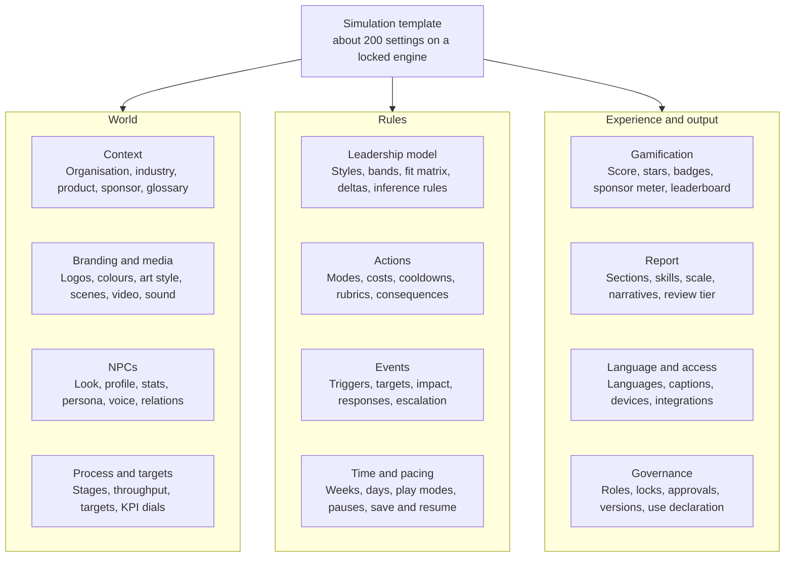

# GenieKreator Configuration Spec: iLead Simulation

> Source of truth: https://claude.ai/code/artifact/1980cc27-e1df-4750-8b9e-59bd80400633 (Claude Doc, exported 2026-10-01). Doc priority: 2. This file is a verbatim markdown export for search and review; if it ever disagrees with the live doc, the live doc wins. Do not edit by hand.

2026-10-01 · @Manu Nair

## Summary

In GenieKreator, every part of the iLead simulation that a learner sees, hears or is scored on is configurable data, except the engine itself. An author can turn the default Secure Capital Bank sales team into a pharma field force, a retail store or a dark store operation by changing context, people, images, voices, process, actions, events, scoring, gamification and report. They never touch code.

**What is configurable vs locked**

| Configurable (12 areas, about 200 settings) | Locked engine (same for every client) |
|---|---|
| Organisation, scenario and product context | Turn loop: week, day budget, action, consequence |
| Branding, images, video and audio assets | State model maths: how deltas apply, clamps, decay |
| NPCs: roles, profiles, images, voices, personas, relationships | Evaluation pipeline: rubric, then outcome band, then authored consequences |
| Team structure, process stages, targets, KPIs | Safety guardrails for NPCs and participant inputs |
| Leadership model and fit rules | Data privacy and audit logging |
| Actions, live interactions, rubrics, consequences | Report formulas (inputs and weights are configurable) |
| Events and NPC initiated moments |  |
| Time, pacing and play modes |  |
| Gamification |  |
| Report sections, skills framework, narratives |  |
| Language, accessibility, delivery |  |
| Governance: roles, approvals, versions |  |

**How each setting gets its value**

1. **AI generated from context.** The author gives a brief and optional uploads (org chart, process docs, values, product sheets, brand kit), and GenieKreator drafts a value for every setting.
2. **Author edited.** Every value can be changed in a form, or in plain language ("make the sponsor more demanding").
3. **Locked by admin.** A client admin can lock settings, such as brand colours or the skills framework, so authors cannot change them.

Each settings table below shows the setting, its type or options, the iLead default, and what the AI generates from context.

## Configuration map

The 12 areas fall into three groups: the World the participant enters, the Rules that decide consequences, and the Experience and output around them.

_Diagram reconstructed as Mermaid from the drawing embedded in the source doc. Labels are verbatim._

_Caption: configuration map, 12 areas in 3 groups._

Areas are generated in this order, World first, so each later area can draw on the earlier ones.

## Organisation, scenario and product context

This layer is the context engine input: everything else is generated from it. A richer brief produces more realistic NPCs, events and dialogue.

**Organisation**

| Setting | Type or options | iLead default | AI generates from context |
|---|---|---|---|
| Organisation mode | Real client name, fictional twin, or fully fictional | Fictional (Secure Capital Bank) | Fictional twin that mirrors the client's industry and scale without naming it |
| Organisation name and tagline | Text | Secure Capital Bank | Name options in the client's naming style |
| Industry and sub industry | Picklist plus free text | Banking, retail lending | Taken from the brief |
| Size, structure, ownership | Picklists | Small, growth stage | Inferred from uploads |
| Region, city, office type | Text, picklist | Singapore City Branch | Local branch, store, plant or site name |
| Culture and values | Up to 6 values with one line each | Trusted client relationships | From the client's values document |
| Competitors | Up to 5 fictional or real names | Beta Bank, Hert Capital | Fictional rivals matching the market |
| Business situation | Turnaround, growth, change, crisis, merger, new launch | Turnaround after a weak manager | From the stated business challenge |
| Glossary | Term and meaning pairs | CASA, conversion | Client jargon pulled from uploads, used by NPCs |
| Policies NPCs follow | Upload or text (HR, compliance, sales conduct) | None | Rules for hiring, firing, rewards and claims |

**Product or service**

| Setting | Type or options | iLead default | AI generates from context |
|---|---|---|---|
| Product lines | 1 to 5, name and description | CASA, Loans, Cards | From product sheets |
| Focus product | One of the above | Loans | The line tied to the business target |
| Value proposition and differentiators | Text | Low risk, attractive rate | Talking points NPCs and customers reference |
| Known weaknesses or criticisms | Text | Features not innovative | Seeds for events such as review site criticism |
| Customer segments | Up to 4 | Individuals, companies | Segment personas for funnel and events |
| Unit of value | Revenue, units, accounts, NPS, cases closed, uptime | Revenue | From the client's main KPI |
| Currency and number format | Picklist | USD | From region |

**Scenario and role**

| Setting | Type or options | iLead default | AI generates from context |
|---|---|---|---|
| Participant role title | Text | Sales Director | Client's own job title (Area Manager, Store Manager, DHM) |
| Level and span | First line, mid, senior; team size | Mid manager, 10 | From audience |
| Backstory | Text | Predecessor left the team in shatters | 3 options matched to business situation |
| Sponsor persona | Name, title, image, voice, style (supportive, demanding, distant) | Roger Kent, CEO | Leader in the client's hierarchy (Regional Head, CHRO) |
| Welcome message | Rich text | CEO welcome letter | Written in the sponsor's voice |
| Tone of the world | Formal, friendly, high pressure, playful | Professional | From culture |
| Realism level | Grounded, slightly dramatised, high drama | Grounded | Default grounded for senior audiences |

## Branding, images and media

Every visual can come from three sources: the client's upload, a licensed stock library, or AI generation in a chosen art style. One art style applies across all generated images, so the world looks consistent.

**Brand and theme**

| Setting | Type or options | iLead default | AI generates from context |
|---|---|---|---|
| Brand ownership | KNOLSKAPE only, client only, both | KNOLSKAPE plus iLead | Client logo placement from brand kit |
| Logos | Upload: main, light, icon | iLead, KNOLSKAPE |  |
| Colour theme | Primary, secondary, accent, status colours; light and dark | iLead blue and amber | Extracted from brand kit, checked for contrast |
| Fonts | Brand font upload or web font | iLead default | Closest web safe match |
| Simulation title and subtitle | Text | iLead DEMO | Client programme name |
| Loading and end screen art | Image | Office background | Generated in the art style |

**Images**

| Setting | Type or options | iLead default | AI generates from context |
|---|---|---|---|
| Art style | Photographic, illustrated flat, illustrated 3D, line art | Photographic | Recommended by audience and brand |
| Background scenes | Office, branch, store floor, warehouse, plant, hospital, field, virtual; per screen | Meeting room | Matched to the workplace in the brief |
| Workplace props | Uniforms, devices, signage, product packaging | None | Drawn from industry and product |
| NPC portraits | Upload, stock or generate; set per NPC (see NPCs) | Stock photos | Generated to match each profile |
| Expression set per NPC | Neutral, happy, concerned, frustrated, thinking | One photo | 5 expressions generated from the base portrait, shown by mood |
| Event illustrations | Per event card | None | One image per event (CRM rollout, review site, festival rush) |
| Icons for actions and stages | Icon set picker | iLead icons | Matched to new stage names |
| Image safety | Auto checks for brand, offensive content, real person likeness |  | Blocks likeness of real people unless consented |

**Video and audio assets**

| Setting | Type or options | iLead default | AI generates from context |
|---|---|---|---|
| Sponsor welcome video | None, avatar video, uploaded video | Text letter | Avatar video of the sponsor reading the welcome |
| Intro and tutorial video | Upload or generated | Video link in HUD | Short walkthrough with the client's names |
| Ambient sound | Off, office, store, warehouse | Off | Matched to workplace |
| UI sounds | Off, subtle, game like | Subtle |  |
| Background music | Off, calm, upbeat | Off |  |

## NPCs

An NPC is any AI character: team members, the sponsor, job candidates, customers, peers and HR. Each NPC is one record with 5 groups of settings (look, profile, stats, persona, voice), plus roster and relationship settings for the whole cast. The author can regenerate one group (for example only the voice) without touching the rest.

**Roster level**

| Setting | Type or options | iLead default | AI generates from context |
|---|---|---|---|
| Team size | 4 to 16 | 10 | From span of control |
| Members per role | 1 to 4, per stage | 2 | From the process |
| Supporting cast | Sponsor, HR partner, peer manager, customers, candidates | Sponsor only | Cast list matched to the actions switched on |
| Archetype mix | Required archetypes: top performer, low performer, complainer, role seeker, rival hire, quiet expert, new joiner, near retirement | 5 archetypes implied | Balanced mix so every leadership style is needed at least twice |
| Diversity settings | Gender, age, ethnicity, nationality and name mix; or mirror the client's workforce data | Mixed | Mix matched to region with culturally correct names |
| Hiring pool | 0 to 6 candidates with hidden true profiles | Not shown | Candidates with interview personas |

**Per NPC: identity and look**

| Setting | Type or options | iLead default | AI generates |
|---|---|---|---|
| Name, pronouns, age band | Text, picklist | Kent Goldberg | Regionally appropriate names |
| Portrait source | Upload, stock, generated | Stock photo | Generated in the art style |
| Look | Age, attire, setting, accessories | Office wear | Attire by industry (uniform, lab coat, store polo) |
| Expression set | 5 moods | One photo | Generated from the portrait |
| Avatar mode | Static portrait, animated portrait with lip sync, video avatar | Static | Animated for 1:1 RolePlays |

**Per NPC: role and profile**

| Setting | Type or options | iLead default | AI generates |
|---|---|---|---|
| Role in team | Any stage or support role | Sales lead | From the process |
| Job title | Text | Implied | Client title |
| Previous company, tenure, experience | Text, numbers | The Japanese International Bank, 1 month, 3 years | Plausible history |
| Skills list | 1 to 4 skills | Lead Generation, Negotiation | From role |
| Remarks visible to the leader | Text | Expected more, complaining | The visible cue for the archetype |
| Hidden concern | Text, revealed only through conversation | Implied | One concern per NPC tied to an event or action |
| Career goal | Text | Justin wants Conversion | Drives role fit and motivation |

**Per NPC: stats and fit**

| Setting | Type or options | iLead default | AI generates |
|---|---|---|---|
| Starting Skill, Morale, Result | 0 to 100 each | Kent 30 / 22 / 49 | Set by archetype, then balanced |
| Starting Trust | 0 to 100 | Not used | 50, lower for wary archetypes |
| Role fit matrix | Skill, Motivation, Performance per role | Hidden | Derived from skills list and career goal |
| Needed style override | Optional fixed style per week | Derived from bands | Usually left to the band rules |
| Sensitivity weights | How strongly they react to recognition, criticism, change, workload | Uniform | Varied by persona (Jack very sensitive to recognition) |

**Per NPC: persona and behaviour**

| Setting | Type or options | iLead default | AI generates |
|---|---|---|---|
| Personality sliders | Openness, assertiveness, warmth, resilience, candour (1 to 5 each) | Implied in remarks | Set from archetype |
| Communication style | Direct, polite, verbose, terse, emotional, formal | Templated | Matched to culture |
| Attitude to the leader at start | Supportive, neutral, sceptical, hostile | Neutral | From backstory |
| Pressure response | Withdraws, argues, over promises, escalates |  | One per NPC |
| Opening lines and catchphrases | Text | "Hi, I'm Kent. How do you do?" | Written in persona |
| Knowledge scope | What the NPC knows: own work, team gossip, customer details, policy |  | Bounded to stop hallucination |
| Off limits topics | List |  | Personal health details, politics, anything in client policy |
| Memory depth | Last 3, 5 or all interactions |  | 5 by default |

**Per NPC: voice**

| Setting | Type or options | iLead default | AI generates |
|---|---|---|---|
| Voice source | Library voice, client licensed voice, none (text only) | None | Library voice matching age, gender and region |
| Language and accent | Any supported language and regional accent |  | Accent of the client region, mixed if the team is global |
| Pitch, pace, warmth | Sliders |  | From persona |
| Emotional range | Flat, moderate, expressive; mood linked |  | Moves with the NPC's current Morale |
| Pronunciation dictionary | Word and phonetic pairs |  | Names, product terms, acronyms |
| Voice consent record | Required for any cloned or licensed voice |  | Blocks unlicensed cloning |

**Relationships between NPCs**

| Setting | Type or options | iLead default | AI generates |
|---|---|---|---|
| Relationship map | Pairs with type: allies, rivals, mentor, friends, conflict | None | 3 to 5 links that create ripples |
| Influence | Who sways team opinion (0 to 100) | Implied (Kent complains to others) | Higher for top performers and complainers |
| Ripple rules | When A is rewarded, criticised or moved, how B reacts | Jack reacts to others' bonuses | Generated from the map and sensitivity weights |

## Team structure, process, targets and KPIs

The sales funnel is one instance of a general process pipeline. Any chain of stages where work flows from one role to the next can replace it: a store, a dark store, a contact centre, a field force, a project team.

**Process pipeline**

| Setting | Type or options | iLead default | AI generates from context |
|---|---|---|---|
| Process type | Sales funnel, service flow, operations line, project delivery, custom | Sales funnel | From the client's process docs |
| Number of stages | 3 to 7 | 5 | From the process |
| Stage names, icons, tooltips | Text, icon, rich text | Sales lead, Qualify, Proposal, Negotiate, Conversion | Client's own stage names (Inbound, Pick, Pack, Dispatch, Deliver) |
| Work unit | Lead, order, ticket, patient, case, task | Lead | From the process |
| Ideal throughput per stage per week | Numbers | 3, 2, 1, 1, 1 | Back calculated from the target |
| Throughput formula weights | How Skill, Morale and Result of the 2 stage owners drive output | Engine default | Balanced in the quality gate |
| Bottleneck rules | Stage capacity, carry over of unprocessed work | Carry over on |  |
| Parallel or branching stages | Optional: a stage can split (for example returns vs deliveries) | Linear | Suggested only when the process branches |

**Targets and KPIs**

| Setting | Type or options | iLead default | AI generates from context |
|---|---|---|---|
| Primary target | Revenue, units, SLA %, NPS, cases resolved | $240,000 | From the client's main KPI |
| Value per completed unit | Number | $30,000 per conversion | Realistic for the industry |
| Secondary targets | Up to 3: team skill, morale, attrition, quality | Improve skill, morale, performance | From the brief |
| Team KPI dials | Choose 3 to 5 from Skill, Morale, Result, Trust, Engagement, Quality, Safety | Skill, Morale, Result | Adds the client's quality KPI if relevant |
| KPI labels | Rename any dial |  | Client language (Productivity instead of Result) |
| Weekly drift | Automatic decline of morale or result when nothing is done | About 3 points per week |  |
| Win condition | Hit target, hit target and keep morale above X, or best score | Target |  |

## Leadership model and scoring rules

The leadership model is the yardstick for every weekly choice and every live interaction. Authors can keep the iLead model, pick another framework, or load the client's own.

| Setting | Type or options | iLead default | AI generates from context |
|---|---|---|---|
| Framework | iLead 4 styles, Situational Leadership style labels, coaching styles, client framework upload | Directing, Guiding, Partnering, Entrusting | Maps a client framework onto the engine's 4 slots |
| Number of styles | 3 to 6 | 4 |  |
| Style names and definitions | Text per style | In game definitions | Client terms (for example Tell, Sell, Share, Delegate) |
| Readiness bands | Thresholds on current Skill and Morale (and optionally Trust) | Hidden engine values | Proposed bands, checked in the balance test |
| Fit matrix | Which style suits which band | Hidden | Drafted from the framework |
| Per member exceptions | Style override for a person and week | None | Used for special stories (an NPC in crisis needs Guiding) |
| Role misfit penalty | How much a poor role fit reduces style gains | Strong (Justin failed all styles) | Moderate by default, so feedback stays readable |
| Delta table | Morale and Result change for match and mismatch | About +2 to +3, -1 to -2 |  |
| Team feedback messages | Copy by share of matches (below half, half, majority, all) | 3 messages seen | Rewritten in the sponsor's voice |
| Style tags for action options | Which style each static option and each live behaviour counts as | Fixed per option | Generated with the option text |
| Style inference rules for live interactions | Behaviour indicators per style (for example detailed instructions = Directing, asking for their plan = Entrusting) | Not in current build | Indicators drafted per framework |
| Intent vs action rule | How often a gap costs Trust | Not in current build | Gap 2 weeks in a row costs Trust |

## Actions and live interactions

The action catalogue starts with the 13 iLead actions and the 2 new live ones (Reply to NPC messages, Sponsor briefing). Authors can rename, hide, clone or create actions. Each action has a common record; live actions add an interaction record.

**Per action**

| Setting | Type or options | iLead default | AI generates from context |
|---|---|---|---|
| Name, icon, description | Text, icon | Send email, Coach member | Client language ("Huddle" instead of Meet the team) |
| Scope | Team, individual, multi select | Per action |  |
| Mode | Static, hybrid, live | See iLead 2.0 design | Recommended by action type |
| Day cost | 0 to 3 | 1 or 2 |  |
| Cooldown | Days before reuse | Energize: 10 days |  |
| Limits | Max targets, max uses per week or run | Email 3, training 3 |  |
| Eligibility rules | Role coverage, minimum one per role, member available | As in iLead |  |
| Prerequisites | Action that should come first, with a penalty if skipped | Assess before Swap | Suggested chains (Assess then Swap then Train) |
| Options (static) | 2 to 4 options, each with text and a style tag | 4 per action | Rewritten in client context |
| Outcome quotes (static) | Reply per option and band | Templated | Varied quotes in each NPC's persona |
| Base consequences | Skill, Morale, Result, Trust deltas for target and ripple | Engine values | Balanced in the quality gate |
| Unlock condition | Available from week N, or after an event or sponsor unlock | All available |  |

**Per live interaction**

| Setting | Type or options | iLead default | AI generates from context |
|---|---|---|---|
| Format | Email, chat, 1:1 RolePlay, team meeting, sponsor briefing, interview, written plan | Per action |  |
| Input modes allowed | Text, audio, both | Both |  |
| Time limit | Minutes, soft or hard stop | 3 to 5 |  |
| Turn limit | Max participant turns | 12 for RolePlays |  |
| Participant brief | What the participant sees before starting: goal, context, NPC card |  | Written from the scenario and NPC state |
| NPC brief | What the NPC wants, fears, hides and will accept |  | Drawn from persona and hidden concern |
| Difficulty | Easy, standard, tough NPC | Standard | Tougher for senior audiences |
| Opening | Who speaks first, opening line | NPC |  |
| Rubric dimensions | 2 to 4 skills with behavioural anchors per band |  | Drafted from the linkage matrix |
| Concern detection | Phrases or ideas that count as surfacing the hidden concern |  | Generated with paraphrase variants |
| Red flags | Behaviours that force the Harmful band (blame, discrimination, policy breach) |  | From client policy |
| Outcome bands | Strong, Adequate, Weak, Harmful; band names editable | 4 bands |  |
| Consequence table | Deltas per band for target, bystanders and sponsor |  | Balanced in the quality gate |
| Triggers per band | Follow up events, promises logged, concern resolved or escalated |  | Linked to the event deck |
| Hints | Off, on request, after a Weak band | On request | Coaching tips in the client's language |
| Calibration set | 6 to 12 sample answers with author labels |  | Generated samples for the author to label |
| Email specifics | Recipients allowed, CC and BCC, attachments, reply all reactions |  |  |
| Meeting specifics | Attendees, agenda required, NPC to NPC talk on or off |  |  |
| Interview specifics | Number of candidates, question bank on or off, hidden true profile | 2 candidates |  |

## Events and NPC initiated moments

Events make the world move without the participant. GenieKreator generates an 8 week deck from the context (a CRM rollout becomes a WMS rollout for a warehouse) and the author reorders, edits or adds cards.

| Setting | Type or options | iLead default | AI generates from context |
|---|---|---|---|
| Event type | Impact, signal, capacity, diagnostic, opportunity, crisis | 4 types seen | Mix balanced across weeks |
| Theme | Change, competitor, reputation, personal, attrition, compliance, customer, market | CRM, review site, personal, leave | Themes from the client's real pressures |
| Trigger | Fixed week and day, random within a window, conditional (state or action based) | Week start or random | Conditional triggers such as "Morale below 30 for 2 weeks" |
| Probability | 0 to 100% for random events |  |  |
| Target | Team, role, named NPC, sponsor | Team, role, member |  |
| Delivery | News bulletin card, modal, NPC chat message, email in inbox, sponsor call | Bulletin, modal | Delivery matched to the event |
| Text and image | Rich text, image | Short card | Written in the world's tone; illustration generated |
| Immediate impact | Deltas, capacity loss (days away), funnel change | Seen per event |  |
| Expected response | Action or behaviour the engine rewards | Implied | For example: reply to Kent within 2 days with support |
| Response window | Days before an ignored event escalates |  | 2 to 5 days |
| Escalation chain | Follow up event if ignored or mishandled |  | Complaint to sponsor, transfer request |
| Repeat rules | Once, recurring, cooldown | Once |  |
| Label on card | Show or hide "no impact on result" style labels | Shown | Hidden by default, since labels can mislead |
| Deck order and pacing | Events per week, intensity curve | 1 to 3 per week | Rising pressure to Week 6, then a recovery window |

## Time, pacing and play modes

| Setting | Type or options | iLead default | AI generates from context |
|---|---|---|---|
| Play mode | Full, Standard, Lite, custom | Full in iLead 2.0 | From session length in the brief |
| Simulated weeks | 2 to 12 | 8 |  |
| Days per week | 3 to 7 | 5 | Matches the client's shift pattern (6 days for retail) |
| Time unit label | Week, sprint, shift, month | Week |  |
| Live interaction cap | Per week and per run | 2 per week |  |
| Real time limit | Off, total minutes, minutes per week | 20 minutes | Off or generous in Full mode |
| Clock pause rules | Pause during live interactions, modals, reports | No pauses | Pause during live interactions |
| Save and resume | On or off; resume window in days | Off | On for Full mode |
| Sittings | 1 to 4, with week breaks defined | 1 | 2 sittings for Full |
| Self paced vs facilitated | Self paced, facilitator controls week advance, cohort sync | Self paced |  |
| Facilitator controls | Pause cohort, inject event, extend time, reset a participant | None |  |
| Practice week | Optional Week 0 tutorial with no scoring | Guided tour only |  |

## Gamification settings

Score logic is defined in the [iLead 2.0 design doc](https://claude.ai/code/artifact/b33f381d-0c32-4308-9783-191ad61da6b3). Every element below can be switched off, retuned or rethemed.

| Setting | Type or options | iLead 2.0 default | AI generates from context |
|---|---|---|---|
| Elements on or off | Score, stars, streaks, badges, sponsor meter, unlocks, Team Pulse, leaderboard, tiers | All on | Off set for selection use |
| Score weights | Business, People, Leadership (sum 100) | 30 / 30 / 40 | From the client's stated outcome |
| Score scale | 0 to 100, 0 to 1000, custom | 0 to 1000 |  |
| Star thresholds | 3 values | 50 / 70 / 85 |  |
| Streak rules | Length to start, bonus per week, cap | 3 weeks, +25, 100 |  |
| Badge library | Add, edit, remove; rule builder (event, condition, count); name, icon, copy | 10 badges | Names and icons in the client's theme |
| Sponsor meter | Start value, gains and losses per trigger | 50; per design doc |  |
| Unlock rewards | Bonus day, hire budget, extra team activity, custom | 3 unlocks | Rewards that fit the scenario |
| Tier names and thresholds | 2 to 5 tiers | Bronze to Platinum | Client themed names |
| Leaderboard | Scope (cohort, business unit, global), size, anonymity, window | Cohort, top 10, named | Anonymous for mixed seniority cohorts |
| Celebrations | Animation level: none, subtle, full | Subtle |  |

## Report settings

| Setting | Type or options | iLead 2.0 default | AI generates from context |
|---|---|---|---|
| Report sections | Choose and order the 10 sections | All 10 | Shorter set for Lite mode |
| Skills framework | iLead default 8 skills, KNOLSKAPE Skills Ontology, client framework upload | iLead default | Maps client skills to evidence sources |
| Linkage matrix | Skills by interaction, minimum 2 observations per skill | Default matrix | Rebuilt for the chosen actions; warns on any skill under 2 |
| Rating scale | Levels, labels, colours | Novice to Role Model, 5 levels |  |
| Behavioural anchors | Text per skill and level | Drafted | From the client's skill definitions |
| Narrative bank | Copy per band, style and section | Template copy | Written in the client's tone and language |
| Evidence quotes | Number per skill, redaction of names | 2 per skill |  |
| Development plan | Practice activity, on the job action, check in date per priority | 3 priorities | Linked to the client's learning catalogue |
| Audiences | Participant, manager, L&D admin, cohort view | Participant and L&D |  |
| Delivery | In app, PDF, email, LMS record | In app and PDF |  |
| Branding | Same as simulation, or report specific | Same |  |
| Human review tier | Off, sample audit, full assessor review | Sample audit | Full review suggested for high stakes use |

## Language, accessibility, delivery and governance

| Setting | Type or options | Default | AI generates from context |
|---|---|---|---|
| Content languages | One or many; participant picks at start | English | Full translation of copy, NPC dialogue and report |
| Mixed language play | Participant may speak or type in a different language from the UI | Off |  |
| Locale formats | Dates, numbers, currency, names order | From region |  |
| Accessibility | Captions for all voice, transcripts, keyboard only play, screen reader labels, reduced motion, high contrast, text size | All on |  |
| Typed fallback in voice interactions | Always available | On |  |
| Devices | Desktop, tablet, mobile (Lite only) | Desktop and tablet |  |
| Low bandwidth mode | Static portraits, text NPCs, no ambient audio | Auto |  |
| Integration | SCORM 1.2, SCORM 2004, xAPI, LTI, API; SSO | Platform default |  |
| Data and consent | Audio consent screen, retention period, transcript storage, region of storage | Consent on, retention set by client |  |
| Roles and permissions | Admin, author, reviewer, facilitator, viewer | All roles |  |
| Locks | Admin can lock any setting for authors | Brand, skills framework |  |
| Approval workflow | Draft, in review, approved, published; reviewer sign off per area | On |  |
| Versioning | Version history, compare, roll back, clone to a new client | On |  |
| Templates | Save any configured simulation as a reusable template | On |  |
| Use declaration | Development or selection use (changes report, leaderboard and review defaults) | Development |  |

## Authoring workflow, AI assist and quality gates

**The brief (about 8 questions)**

1. Who is the participant: role title, level, team size, region, language?
2. What industry and organisation, real or fictional?
3. What product or service, and what is the main business target?
4. What is the business situation: turnaround, growth, change, crisis?
5. Which 3 to 6 skills matter most?
6. How long is the session, and is it facilitated or self paced?
7. Is it for development or for selection decisions?
8. Uploads: org chart, process docs, values, product sheets, brand kit, skills framework (all optional).

**Generation order and editing**

1. Context and scenario, then process and targets, then NPCs, then leadership model, then actions and interactions, then events, then gamification, then report. Each later step reads the earlier ones, so a changed process regenerates stage specific events and rubrics.
2. Regenerate at any scope: the whole simulation, one area, one NPC, or one field ("new voice for Peter").
3. Plain language edits: "make the sponsor tougher", "add a night shift lead who resists change", "set it in Dubai".
4. Change impact warnings: editing stats, deltas or thresholds marks the balance test as stale until it is rerun.

**Quality gates before publish**

| Gate | What it checks | Pass rule |
|---|---|---|
| Balance test | AI players (strong, one style, careless, random) play 50 or more runs | Strong reaches the target and Gold tier; careless stays below target and in Bronze |
| Style coverage | Every style is the right answer for at least 2 members across the run | No unused or dominant style |
| Rubric calibration | AI bands vs author labels on the calibration set | At least 85% agreement per interaction |
| Persona test | Each NPC faces off topic, hostile and manipulative inputs | Stays in role, follows off limits rules |
| Content safety | Images, names, voices, copy | No real person likeness or unlicensed voice; no flagged content |
| Linkage check | Report skills have enough evidence | Each skill has at least 2 observation points |
| Accessibility check | Contrast, captions, keyboard flow | Meets WCAG 2.2 AA |
| Preview | Author plays one full week with a debug panel showing hidden state | Author sign off |
