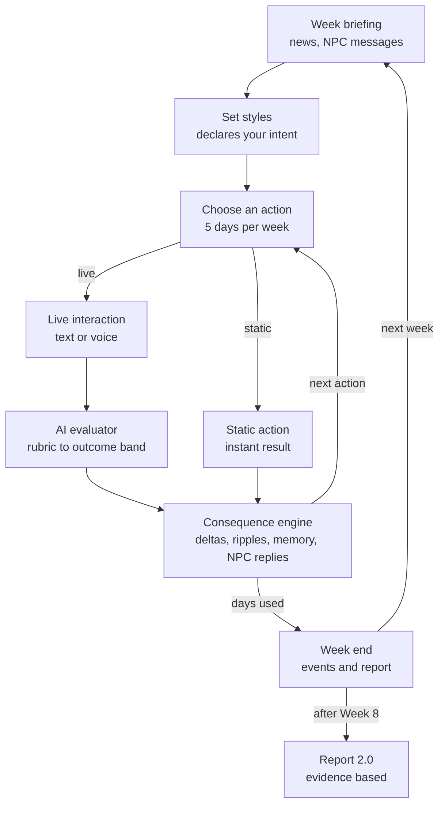

# iLead 2.0: AI Authored, Interactive Simulation Design

> Source of truth: https://claude.ai/code/artifact/b33f381d-0c32-4308-9783-191ad61da6b3 (Claude Doc, exported 2026-10-01). Doc priority: 3. This file is a verbatim markdown export for search and review; if it ever disagrees with the live doc, the live doc wins. Do not edit by hand.

2026-10-01 · @Manu Nair

## Verdict

Yes, with conditions. Moving iLead from click and select to a hybrid of strategic choices plus live text and audio interactions will improve both the experience and the report, because the report can finally show what the participant actually said and did, not just which option they picked. It only works if three things are designed in from day one: a tight time budget, rubric based scoring that stays consistent across text and audio, and an NPC state model that makes every conversation matter later.

|  | Today (iLead DEMO) | iLead 2.0 hybrid |
|---|---|---|
| What is measured | Option picked from 4, mapped to a style | Behaviour shown in an email, chat or conversation, mapped to style and to skills |
| Evidence in the report | Percentages and a per member table | Percentages plus quoted evidence, skill ratings on anchored scales, key moments |
| Gaming risk | High: options read like the 4 styles, so players learn the pattern | Low: no menu of right answers; the participant must produce the behaviour |
| NPC realism | Templated quotes, same reply for 3 trainees | Replies shaped by the NPC's profile, memory and current state |
| Session length | 20 minutes, which ended my run at Week 4 | About 100 minutes in Full mode (or 2 sittings), 65 to 75 in Standard, 30 to 35 in Lite |
| Build and run cost | Low | Higher: speech, LLM evaluation, calibration, review tooling |

**Where it can go wrong:** an LLM that scores the same email differently on two runs, speech recognition that rates accented speakers lower, NPCs that drift off persona, and a simulation so long that cohorts drop out. Each is addressed in the sections below and listed under Risks.

## Target gameplay flow

The participant still makes the strategic calls each week, then performs the critical ones live. Static and live actions share one consequence engine, so both move the same team state.

_Diagram reconstructed as Mermaid from the drawing embedded in the source doc. Labels are verbatim._


_Caption: iLead 2.0 weekly loop, static and live paths. Title on the drawing: "Decide, then do: every live interaction feeds the simulation"._

Live interactions pass through the AI evaluator first; static actions skip it. NPC messages in the briefing can open a live chat before any action is chosen.

## Interaction formats and input options

Seven formats cover every workplace action iLead needs. Each one accepts text or audio, so the participant chooses how to respond and the scoring stays the same either way.

| Format | Feels like | Text input | Audio input | Typical length | Best for |
|---|---|---|---|---|---|
| Email composer | Outlook style draft to one or many | Type | Dictate, then edit before sending | 2 to 4 min | Recognition, warnings, announcements, team motivation |
| Chat | Slack or Teams thread, NPCs message first too | Type | Voice note | 1 to 3 min | Quick check ins, replies to NPC complaints, nudges |
| 1:1 AI RolePlay | Live conversation with one NPC | Type turn by turn | Speak, NPC replies in voice | 3 to 5 min | Meet face to face, coaching, feedback, difficult talks |
| Team meeting | Huddle with 3 to 10 NPCs who talk to each other | Type | Speak | 5 to 7 min | Kick off, change announcements, morale resets |
| Briefing to sponsor | Update to the CEO NPC, who probes | Type a short update | Speak a 2 minute update, then Q&A | 3 to 4 min | Mid point and end of journey review |
| Interview | Structured interview with an AI candidate | Type questions | Speak | 4 to 5 min | Hire member |
| Written plan | A short form: goals, milestones, owners | Type into fields | Dictate per field | 2 to 3 min | Set Goals, development plans |

**Input rules that keep scoring fair**

- Score the words, not the voice. Audio is transcribed and evaluated on the transcript, so accent, pace and pitch never change a skill rating.
- Audio can add descriptive analytics only: talk to listen ratio, open versus closed questions, interruptions. Show these as coaching data, never as scores.
- No facial or voice emotion inference. It is unreliable and creates legal exposure in several regions.
- Always show the transcript before submit for email, chat and written plan, so the participant can fix speech recognition errors.
- Offer a typed fallback inside every voice interaction for noisy environments and accessibility.

## Action by action recommendation

Rule of thumb: keep an action static when the real world decision is a choice or a logistics step; make it live when the real skill is in the words a leader uses. 4 actions stay static, 3 become hybrid (decide, then communicate), 7 become live AI interactions, and 2 new live interactions are added.

| Action today | Recommendation | Format | Days | What the AI evaluates | Main state effects |
|---|---|---|---|---|---|
| Weekly style setting | Static | Dropdown per member, optional one line rationale | 0 | Nothing live; becomes the declared Intent | Intent is later compared with the style the participant shows in conversations |
| Assess member | Static | Data card | 1 | None | Reveals role fit; unlocks informed swaps |
| Send for training | Static | Select up to 3 | 1 or 2 | None | Skill gain after return; role coverage check stays |
| Energize the team | Static, with optional 60 second toast | Choice, optional voice toast | 1 or 2 | Toast only: warmth, inclusion | Team morale; cooldown stays |
| Swap or Reassign roles | Hybrid | Select members, then a 3 minute 1:1 to explain the move | 1 | Rationale, empathy, clarity of new expectations | Morale of moved members; trust; bystander reactions |
| Reward member | Hybrid | Select reward, then write the recognition note | 1 | Specificity, fairness, link to results | Recipient morale and result; fairness ripple on peers such as Jack |
| Fire member | Hybrid | Select member, then a 4 minute exit conversation | 1 | Dignity, clarity, policy compliance | Team morale and trust; HR escalation event if handled badly |
| Send email | Live | Email composer | 1 | Intent vs message, tone, specificity, fairness | Each recipient replies; non recipients may react |
| Meet face to face | Live | 1:1 AI RolePlay, 5 minutes | 1 | Style shown vs style needed, listening, surfacing the hidden concern | Morale, trust, memory; can resolve or escalate an issue |
| Coach member | Live | 1:1 AI RolePlay using a coaching structure | 1 | Question quality, ownership, next steps (GROW) | Skill and result; NPC commits to a specific action |
| Give feedback | Live | Chat or 1:1 AI RolePlay | 1 | Situation, behaviour, impact clarity; balance | Morale and result; repeated poor feedback lowers trust |
| Set Goals | Live | Written plan plus a 2 minute check in | 1 | Goal quality (specific, measurable), involvement matched to style | Commitment level drives that member's funnel output next week |
| Hire member | Live | Interview 2 candidates, then choose | 2 | Structured questions, bias free probing, decision rationale | Hidden true profile of hire is revealed over the next weeks |
| Meet the team | Live | Team meeting, 5 to 7 minutes | 1 | Agenda, inclusion of quiet NPCs, handling conflict | Team morale, alignment; concerns raised become events |
| New: Reply to NPC messages | Live | Chat, NPC starts it (complaint, leave request, Kent's personal issue) | 0 | Responsiveness and fit to the situation | Ignoring a message escalates it next week |
| New: Sponsor briefing | Live | Briefing to the CEO at Week 4 and Week 8 | 0 | Ownership of results, honesty, plan quality | Sponsor support unlocks budget or hires; feeds the report |

The weekly style dropdown stays static on purpose. It captures what the participant intends, and the live conversations capture what they actually do. The gap between the two is the most valuable insight in the report.

## How interaction quality changes the simulation

The AI judges the interaction; authored rules decide the consequences. Keeping those two jobs separate is what makes the simulation fair, repeatable and explainable in the report.

**NPC state: what each team member carries across 8 weeks**

| Field | Exists today | Role in iLead 2.0 |
|---|---|---|
| Skill, Morale, Result (0 to 100) | Yes | Unchanged; still drive the funnel and the needed style |
| Needed style band | Hidden | Derived each week from Skill and Morale; the yardstick for every interaction |
| Trust in leader (0 to 100) | No | Rises with fair, consistent handling; low trust makes the NPC guarded and less honest in conversations |
| Hidden concern | Implied in remarks | One authored issue per NPC (Kent's unmet expectations, Justin's role wish, Peter's confidence). Surfacing it in conversation unlocks the big gains |
| Memory | No | Short log of what the leader said and promised. NPCs quote it back and react if promises are broken |
| Persona | Profile text | Personality, voice, vocabulary and how they react to pressure, used by the NPC model |

**Evaluation pipeline for every live interaction**

1. Capture: text or transcript, plus the participant's declared intent for that member that week.
2. Evaluate against an authored rubric: style shown (Directing, Guiding, Partnering, Entrusting), 2 to 4 skill dimensions for that action, whether the hidden concern was surfaced, and any red flags (blame, unfair treatment, policy breach).
3. Convert to an outcome band: Strong, Adequate, Weak or Harmful. Bands, not raw LLM numbers, keep results stable across runs.
4. Apply authored consequences for that band: deltas to Skill, Morale, Result and Trust for the target, plus ripple rules for bystanders.
5. Update memory and triggers: a promise is logged, a concern is resolved or escalated, a follow up event is scheduled.
6. Generate the NPC reply in persona, consistent with the band, and store quoted evidence for the report.

**Example: Kent after the personal crisis event (Week 3****; values are illustrative until balanced****)**

| Band | What the participant did | Consequence |
|---|---|---|
| Strong | Acknowledged the situation, asked what he needs, then agreed 2 concrete tasks for the week | Morale +8, Trust +10, Result +5; concern resolved; no further leads lost |
| Adequate | Showed care but left the plan vague | Morale +3, Trust +3; Result flat |
| Weak | Went straight to targets, ignored the personal issue | Morale -4, Trust -6; event "Kent blocks Beth's leads" fires next week |
| Harmful | Dismissive or threatening | Morale -10, Trust -15; Kent requests a transfer; team morale -2 |

**Ripples and long tail effects**

- Fairness: recognising one person can lower peers who outperform them, as the Jack bonus showed in the current build. The email and reward evaluators check who else deserved credit.
- Consistency: if the declared style and the shown style differ for the same member two weeks running, that NPC loses trust (mixed signals).
- Promises: a commitment made in a 1:1 becomes a check in Week n+1; breaking it costs Trust.
- Escalation: ignored NPC messages grow into public events, such as a complaint to the CEO.

## Pacing the 8 week journey

A full 8 week run takes about 95 to 105 minutes, not the 60 to 75 I first estimated, once the fixed weekly steps are counted. Live interactions are about 60% of that time. Real time pauses during live interactions, so careful players are not cut off as I was at Week 4 in the DEMO.

**Where the time goes (full mode)**

| Component | Per week | 8 weeks |
|---|---|---|
| Onboarding: intro, meet the team profiles |  | 5 min (once) |
| Briefing and news | 1 min | 8 min |
| Weekly style setting for 10 members | 1.5 min (3 in Week 1) | 13 min |
| Static actions, about 2 per week | 1 min | 8 min |
| Weekly report | 0.5 min | 4 min |
| Live interactions, about 2 per week | 7 min average | 58 min |
| Reading NPC replies and outcomes | 1 min | 8 min |
| **Total** |  | **about 104 min** |

**Live minutes by week (full mode)**

| Week | Focus | Live moments | Live minutes |
|---|---|---|---|
| 1 | Meet the team, first read of people | Team meeting; 1 face to face | 11 |
| 2 | Fix role fit, first change event | Swap conversation; email to team on the new CRM | 6 |
| 3 | Personal and reputational pressure | Chat with Kent; feedback to one member | 6 |
| 4 | Mid point | Coaching session; sponsor briefing | 9 |
| 5 | Recognition and fairness | Recognition note; Set Goals plan and check in | 7 |
| 6 | Capacity shock (leave, attrition) | Interview 2 candidates, or an exit conversation | 8 |
| 7 | Push for conversions | Coaching session with the bottleneck owner | 5 |
| 8 | Close and reflect | Sponsor briefing; short self reflection | 6 |

**Play modes an author can choose**

| Mode | Weeks | Live cap | Typical time | Best for |
|---|---|---|---|---|
| Full | 8 | 2 per week plus 2 sponsor briefings | 95 to 105 min, or 2 sittings of about 50 min | Flagship leadership programmes, development centres |
| Standard | 8 | 1 per week plus 2 sponsor briefings | 65 to 75 min | Single workshop session |
| Lite | 4 | 1 per week | 30 to 35 min | Webinars, pre work, quick demos |

Save and resume is required for Full mode. Shorter conversation defaults (3 minute RolePlays instead of 5) cut about 10 minutes from any mode.

## AI powered authoring flow

An L&D author answers about 8 questions and uploads optional context; GenieKreator drafts the full simulation in 8 steps (step 8, Gamification, is set out in the Gamification layer section), with a review checkpoint after each. The author edits in plain language ("make Peter more defensive") rather than in data tables.

| Step | Author provides | GenieKreator generates | Author checkpoint |
|---|---|---|---|
| 1. Brief | Audience and level, industry, region and language, target skills (3 to 6), duration, outcome the client cares about; optional uploads: process docs, policies, values, real role descriptions | A scenario bible: company, sponsor persona, product or service, business target, tone | Approve the premise |
| 2. Process and goal | Confirm or edit the work process | Funnel or process stages, ideal throughput per week, target and pacing preset | Approve stages and target |
| 3. Team | Optional: team size, mix, any must have archetypes | Roster with profiles, starting stats, role fit matrix, hidden concern, persona and voice for each NPC | Edit people; regenerate one NPC at a time |
| 4. Leadership model | Pick a style framework (default: the 4 iLead styles) or upload the client's own | Style definitions, readiness bands, fit rules | Approve the fit rules |
| 5. Actions and interactions | Choose which actions are static, hybrid or live; set the live cap | Option text, rubrics per live interaction, outcome bands and consequence tables, NPC reply guidance | Review rubrics with example Strong and Weak answers |
| 6. Events | Pick event themes (change, attrition, competitor, compliance) | 8 week event deck: triggers, targets, text, deltas, expected responses | Reorder and edit events |
| 7. Report | Pick report sections and the skills framework | Report configuration, band narratives, development suggestions | Approve copy |

**Before publish: automatic quality gates**

1. Balance test: AI players with 4 profiles (strong leader, one style leader, careless, random) each play 50 or more runs. The strong leader must reach the target; the others must not. Dominant strategies are flagged.
2. Rubric calibration: each rubric is scored on a set of authored sample answers; a run passes when the AI's bands match the author's labels on at least 85% of samples.
3. Persona check: each NPC is tested with off topic and hostile inputs to confirm it stays in role.
4. Preview: the author plays one full week, with a debug panel showing the hidden state.

## Report 2.0 on global standards

The current report shows style percentages and per member tables. Report 2.0 adds behavioural evidence, skill ratings on anchored scales, intent versus action, key moments and a development plan, and it follows six recognised standards and models. Every element traces to engine output or to authored template copy; nothing is invented.

**Standards and what they demand**

| Standard | What it requires | How Report 2.0 meets it |
|---|---|---|
| [Assessment Center Guidelines, International Taskforce (2015)](https://journals.sagepub.com/doi/pdf/10.1177/0149206314567780) | Overt behaviour in job relevant simulations, a linkage matrix of skills to exercises, multiple components, systematic scoring, data integration, standardisation, feedback to participants | Each skill is observed in at least 2 live interactions; a skills by interaction linkage matrix is authored per simulation; ratings integrate across interactions |
| [ITC Guidelines on Quality Control in Scoring, Test Analysis and Reporting (2013)](https://www.intestcom.org/files/guideline_quality_control.pdf) | Computer scoring of open ended responses must be monitored by a human rater and justified by research; reports must be understandable | Rubric calibration before publish, a human audit sample of AI scored interactions, plain language reports, a methodology page |
| [ISO 10667-2:2020 Assessment service delivery](https://cdn.standards.iteh.ai/samples/74717/ec11705c96534a258eb85244f57e7718/ISO-10667-2-2020.pdf) | Informing participants, use of personal data, report preparation, feedback to participants | Consent and data use screen before audio capture; feedback is delivered to the participant, not only to L&D |
| [Situational Leadership (Hersey, Blanchard SLII)](https://en.wikipedia.org/wiki/Situational_leadership_theory) | Four styles matched to follower readiness or development level | Style use reported per readiness band (what you used vs what each band needed), not just overall shares |
| [SBI and SBII, Center for Creative Leadership](https://www.ccl.org/articles/leading-effectively-articles/closing-the-gap-between-intent-vs-impact-sbii/) | Feedback names the Situation, Behaviour, Impact, and asks about Intent | Every insight in the report is written as situation, what you did, its impact, against your stated intent |
| [Kirkpatrick Model](https://www.kirkpatrickpartners.com/the-kirkpatrick-model/) | Reaction, Learning, Behaviour, Results | L&D cohort view reports Level 2 in simulation, and links to Level 3 follow up check ins at 30 and 60 days |

**Important positioning note:** the 2015 guidelines state that a fully automated program without human assessors observing behaviour cannot be called an assessment centre. iLead 2.0 should be positioned as a simulation based development report. For high stakes uses, offer an optional human assessor review layer.

**Participant report structure**

| # | Section | What it shows | Source in the engine |
|---|---|---|---|
| 1 | Executive summary | Overall band on the Novice to Role Model scale, 3 strengths, 3 priorities, one line on business result | Integrated skill ratings, funnel totals |
| 2 | Style flexibility and fit | Style shares (today's page 1), plus a 4 by 4 grid: style used vs style each readiness band needed | Weekly settings and style shown in live interactions |
| 3 | Intent vs action | Per member: declared style vs style actually shown in conversations, with one quoted example where they differ | Style dropdown vs evaluator output |
| 4 | Skills profile | 6 to 8 skills, each on the 5 level scale with behavioural anchors and 2 quoted evidence lines | Rubric bands per interaction, integrated |
| 5 | Key moments | 5 to 7 critical incidents in SBI form: the event, what you did, what changed | Event log, ripples, promises kept or broken |
| 6 | People outcomes | Per member trajectory of Morale, Trust and Result, and where your time went | NPC state history, action log |
| 7 | Business outcomes | Funnel by stage vs ideal, revenue vs target, the bottleneck and why | Funnel engine |
| 8 | Conversation analytics | Talk to listen ratio, open questions, recognition statements, as descriptive data only | Transcripts |
| 9 | Development plan | 3 priorities, each with a practice activity, an on the job action and a check in date | Template copy mapped to lowest skills |
| 10 | Methodology and data use | How AI scoring works, calibration and human review, data retention, how to query a result | Template copy |

**Skills by interaction linkage matrix (iLead default)**

| Skill | Face to face | Coach | Feedback | Email | Team meeting | Set Goals | Swap or Fire talk | Sponsor briefing |
|---|---|---|---|---|---|---|---|---|
| Situational flexibility | Yes | Yes | Yes |  | Yes | Yes |  |  |
| Coaching for growth | Yes | Yes |  |  |  |  |  |  |
| Giving feedback |  |  | Yes | Yes |  |  | Yes |  |
| Recognition and fairness |  |  | Yes | Yes | Yes |  |  |  |
| Communicating change |  |  |  | Yes | Yes |  | Yes |  |
| Goal setting and accountability |  | Yes |  |  |  | Yes |  | Yes |
| Handling difficult conversations | Yes |  | Yes |  |  |  | Yes |  |
| Results ownership |  |  |  |  |  | Yes |  | Yes |

Each skill has at least 2 observation points, which meets the multiple observation principle. Authors can swap in the client's own skills framework in step 7 of authoring.

## Gamification layer

Today's iLead has light gamification: a target progress bar, KPI dials, a conversion animation and a leaderboard ranked only by conversions. That last one rewards revenue alone, which works against a leadership simulation. iLead 2.0 adds a Leadership Score and 7 game elements that reward the same behaviours the report values.

**Rule 1: two scores, never mixed.** The game score drives fun and competition. The skill ratings in the report come only from rubric evidence. Badges and points never change a skill rating.

**Leadership Score (0 to 1000)**

```latex
\text{Score} = 9 \times (0.3B + 0.3P + 0.4L) + \text{Streak bonus}
```

| Input | Meaning | Calculation (0 to 100) |
|---|---|---|
| B, Business | Revenue against target | min(100, revenue / target x 100) |
| P, People | Team health versus the start | 50 + change in average Morale + 0.5 x change in average Trust, clamped 0 to 100 |
| L, Leadership | Quality of leading | 0.5 x style fit % + 0.5 x average live band (Strong 100, Adequate 70, Weak 35, Harmful 0) |
| Streak bonus | Sustained good weeks | Up to 100 points (see Streaks) |

Worked example from my DEMO run: B = 12.5 ($30,000 of $240,000), P = 53 (morale up 3, no trust data), L = 69 (style fit 69%, no live interactions). Score = 9 x (3.75 + 15.9 + 27.6) = 425, which is Bronze.

**Game elements and their logic**

| Element | What the player sees | How it is calculated | Updates |
|---|---|---|---|
| Weekly stars | 1 to 3 stars on each weekly report | Week score = 0.5 x weekly style fit % + 0.3 x average live band + 0.2 x funnel output vs weekly ideal (capped at 100). 1 star at 50, 2 at 70, 3 at 85. With no live interaction that week, the 0.3 moves to style fit | Week end |
| Streaks | Flame counter on the HUD | 3 weeks in a row at 2 stars or more earns +25 points, then +25 per extra week, capped at +100. A broken streak resets the counter but costs nothing | Week end |
| Badges | Earned badge popup and a badge shelf | Rule over the event log (table below); each badge earned once | When the rule fires |
| Sponsor confidence | CEO meter, 0 to 100, starts at 50 | Sponsor briefing band: Strong +20, Adequate +5, Weak -10, Harmful -25; week revenue vs ideal: +5 above, -5 below; issue escalated to the CEO: -10 | Live, after each trigger |
| Unlocks | Bonus resources | Sponsor confidence 70 or more unlocks one of: +1 day once, an extra hire budget, or a team building slot without cooldown. Below 30 triggers a CEO check in that costs a day | When the threshold is crossed |
| Team Pulse | Team meter combining Morale and Trust | Average of team Morale and team Trust, shown with weekly trend arrows | After every action |
| Leaderboard | Cohort rank, top 10 plus your own position | Ranked by Leadership Score; ties broken by conversions, then style fit %. Optional anonymous names | Live during the cohort window |
| End tier | Final title on the end screen | Platinum 850 or more, Gold 700 to 849, Silver 500 to 699, Bronze below 500. Tier names are configurable | End of run |

**Badge library (iLead default)**

| Badge | Fires when | Behaviour it reinforces |
|---|---|---|
| First Close | First conversion lands | Business focus |
| Read the Room | Style fit is 9 or 10 of 10 in one week | Situational flexibility |
| Flex Master | Each of the 4 styles used correctly at least twice | Range of styles |
| Concern Uncovered | Hidden concerns surfaced for 5 NPCs | Listening, coaching |
| Promise Keeper | At least 3 promises made in conversations, all kept | Trust and accountability |
| Fair Hand | 3 recognitions with no negative fairness ripple | Recognition and fairness |
| Turnaround | One member's Morale moves from below 30 to above 60 | Developing people |
| Change Champion | Strong band on 2 change communications (role move, CRM email) | Communicating change |
| Steady Hand | No Harmful band across the whole run | Professional conduct |
| Target Crusher | Revenue reaches the target | Results ownership |

**Guardrails**

- No speed points and no points per action, so players cannot win by rushing or spamming actions.
- Every badge maps to a behaviour the rubric rewards; nothing rewards a behaviour the report criticises.
- The leaderboard is off by default when a client uses results for selection or promotion decisions.
- The balance gate in authoring checks the thresholds: the strong leader bot should reach Gold or above and the careless bot should stay in Bronze.

**How GenieKreator configures it (new authoring step 8: Gamification)**

| Setting | Default | Author can change | AI assist |
|---|---|---|---|
| Elements on or off | All on | Toggle each element | Recommends a set by audience and use (development vs selection) |
| Score weights B / P / L | 30 / 30 / 40 | Any split that sums to 100 | Suggests weights from the client's stated outcome |
| Star and tier thresholds | 50 / 70 / 85; 500 / 700 / 850 | Edit values | Re-runs the balance gate after any change |
| Badge library | 10 badges above | Add, edit or remove with a rule builder: event + condition + count | Generates badge names and copy in the client's theme and language |
| Sponsor unlocks | 3 unlocks | Choose rewards and thresholds | Proposes unlocks that fit the scenario |
| Leaderboard | Cohort, top 10, names shown | Scope, privacy, time window | Flags the setting as risky for assessment use |

Each badge is stored as a small rule the engine evaluates against the event log, for example:

```json
{ "id": "read_the_room", "name": "Read the Room", "event": "week_end", "condition": "style_fit_count >= 9", "repeatable": false }
```

## Risks and decisions needed

| Risk | Why it matters | Mitigation |
|---|---|---|
| Scoring drift | The same email scored differently on two runs breaks trust in the report | Outcome bands not raw scores, fixed rubric prompts, calibration set, human audit sample |
| Speech bias | Speech recognition errors are higher for some accents | Score the transcript only, show transcript before submit, typed fallback |
| NPC off persona or unsafe replies | Breaks immersion; brand and legal risk | Persona guardrails, refusal rules, persona tests before publish |
| Session length | Full mode is about 5 times today's 20 minutes | Live cap per week, clock pauses during live moments, Lite mode, save and resume |
| Cost and latency | Voice turns and evaluation run on every interaction | Cache NPC persona context, stream replies, evaluate after the interaction rather than per turn |
| Comparability across cohorts | Free form input varies more than menu choices | Standardised scenario and events, same rubrics, report bands not percentiles at first |
| Facial or voice emotion analysis | Restricted in several jurisdictions | Out of scope by design |

**Decisions for you**

- Default session model: Full, Standard or Lite, and one sitting or two?
- Live cap: 2 per week (recommended) or author defined?
- Positioning: development report only, or offer a human assessor review tier for high stakes use?
- Default skills framework for the linkage matrix: iLead defaults above or the KNOLSKAPE Skills Ontology?
- Pilot scope: convert Meet face to face and Send email first, measure engagement and scoring agreement, then roll out the rest?
