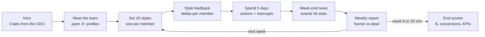

# iLead Gameplay Teardown and GenieKreator Blueprint

> Source of truth: https://claude.ai/code/artifact/9f6a19de-2a6f-4df7-b6b9-36f53fe53a2e (Claude Doc, exported 2026-10-01). Doc priority: Reference. This file is a verbatim markdown export for search and review; if it ever disagrees with the live doc, the live doc wins. Do not edit by hand.

2026-10-01 · @Manu Nair

## Summary

iLead is a situational leadership simulation built on one data model: a team roster with Skill, Morale and Result per person, a 5 stage sales funnel, a day budget, 13 actions, and a weekly event deck. Almost everything a client would want changed lives in that data, which makes iLead a strong first candidate for GenieKreator.

I played the DEMO variant (Secure Capital Bank, Singapore City Branch) as a real participant. The 20 minute real-time clock ran out at Week 4, Day 2 of 8, with 1 conversion ($30,000 of $240,000), Team Skill 57, Morale 57, Result 59.

Top takeaways for GenieKreator:

- **The scenario is a skin; the engine is generic.** Company, product, roles, people, events and dialogue are all swappable text over the same stats and rules.
- **The scoring core is a style fit matrix.** Every week, and every Coach, Set Goals and Meet action, is scored against the style each member needs given their current Skill and Morale. That matrix is the most important thing an author must configure and validate.
- **Rules are explicit and templatable:** day cost per action, cooldowns, max 2 per role, role coverage checks, max recipients, prerequisite chains (Assess before Swap) and ripple effects on peers.
- **The real-time clock is the binding constraint, not the 40 day budget.** Pacing must be configurable per audience.
- **Risk:** a few UI issues (shifting style dropdowns, hover then click selection) and some opaque scoring (one member failed all 4 styles) need fixing before clients author their own versions.

## Simulation flow

The game is one intro followed by a weekly loop that repeats up to 8 times, ending when Week 8 finishes or the 20 minute clock hits zero.

_Diagram reconstructed as Mermaid from the drawing embedded in the source doc. Labels are verbatim._

_Caption: iLead weekly loop, 8 steps, 1 loop. Title on the drawing: "Each week repeats styles, actions, events and a report"._

The style step is the only mandatory gate each week; everything inside the 5 days is the player's choice, interrupted by random modals such as sick leave or a complaint.

## Core model

The whole simulation runs on six objects. Each row below is something GenieKreator would store as data, not code.

| Object | What it holds in the DEMO | Observed behaviour |
|---|---|---|
| Scenario | Secure Capital Bank, CEO Roger Kent, Singapore City Branch, 3 product lines (CASA, Loans, Cards), focus on Loans | Delivered through 3 intro tabs and CEO messages |
| Targets | $240,000 revenue, 8 conversions at $30,000 each, improve team skill, morale and performance | Progress bar in HUD; end screen reports $ and conversions |
| Time | 8 weeks x 5 days = 40 sim days; 20 minutes real time | Clock starts on the dashboard and keeps running during popups; game ends at whichever runs out first |
| Roles (funnel stages) | Sales lead, Qualify, Proposal, Negotiate, Conversion | Exactly 2 members per role; each role has an (i) tooltip; cumulative counts shown on role headers |
| Team members | 10 people, each with photo, prior company, tenure, experience, skills list, remarks | Skill, Morale, Result dials (0 to 100) shown after you open the profile; style tag per member |
| Team KPIs | Team Skill 56, Team Morale 54, Team Result 59 at start | Averages of members; deltas flashed after every action |

**Funnel ideal per week:** Lead 3, Qualify 2, Proposal 1, Negotiate 1, Conversion 1. The funnel modal shows Current week (with Ideal) and All Time; the weekly report shows a cumulative Ideal (Week 3: Lead 48, Qualify 24, Proposal 7, Negotiate 4, Conversion 2). Low skill or morale in a stage throttles that stage, so one weak role becomes the bottleneck.

**Starting roster**

| Member | Role | Skill / Morale / Result | Profile hook the player should act on |
|---|---|---|---|
| Kent Goldberg | Sales lead | 30 / 22 / 49 | Joined 1 month ago, expected more, already complaining |
| Beth Killiney | Sales lead | 25 / 73 / 45 | Ex Beta Bank (rival), left over poor management |
| Justin Keel | Qualify | 22 / 40 / 52 | Finance major, wants to move to Conversion |
| Derick Kaynes | Qualify | 70 / 71 / 62 | Solid, no remarks |
| Green Bell | Proposal | 89 / 56 / 69 | Go-to proposal person, influential contacts |
| Lowe Rex | Proposal | 80 / 45 / 67 | Also skilled in qualification and negotiation |
| Jack Holt | Negotiate | 92 / 85 / 95 | Top performer, many positive appraisals |
| Peter Higgins | Negotiate | 10 / 15 / 16 | Lawyer turned salesperson, declining, loyal, needs encouragement |
| Ruth Ether | Conversion | 80 / 50 / 65 | Perfectionist, strong in conversion |
| Mandy Lobert | Conversion | 60 / 80 / 71 | Known for closing tough deals won from competitors |

Every remark is a deliberate cue: a complainer, a role wish, a low performer, a top performer to protect. A GenieKreator roster generator should produce cues of the same kinds.

## Leadership style mechanic

At the start of every week the player must set one of 4 styles for each of the 10 members, confirm a summary table, and only then act. The match between style and each member's current Skill and Morale drives a per member Morale and Result delta and a team level message.

| Style | In-game definition | Where it fit in my run |
|---|---|---|
| Directing | Be direct and give in-depth instructions | Low skill, low to mid morale: Kent, Peter, Mandy after the swap, Beth in Week 4 |
| Guiding | Seek buy-in from the member to complete the task | Never confirmed as correct for anyone in 4 weeks |
| Partnering | Encourage the member and help in achieving the task | High skill, mid morale: Green, Lowe, Ruth |
| Entrusting | Delegate by giving the big picture and monitor progress | High skill, high morale: Jack, Derick |

**Week by week results**

| Week | Team message | Avg impact (S / M / R) | Mismatches |
|---|---|---|---|
| 1 | Style matches around half the team | 0 / +1 / 0 | Kent, Justin, Beth, Peter, Mandy |
| 2 | On the right track, majority positive | 0 / +1 / +1 | Beth, Mandy, Justin |
| 3 | Majority happy, review the rest | 0 / +1 / +1 | Beth, Mandy, Justin |
| 4 | On the right track, majority positive | 0 / +2 / +2 | Justin only |

Correct matches gave +2 to +3 per member; mismatches gave -1 to -2. The same style is reused to score the option you pick inside Coach, Set Goals and Meet Face to Face, so getting the weekly read right pays off across every individual action.

**The fit is state based, not a fixed label.** Beth with Directing scored -2 in Week 1 (Skill 25, Morale 73) and +3 in Week 4 (Skill 25, Morale 57). So the engine reads bands of current Skill and Morale, and the right answer moves as the player changes those numbers. Justin failed all 4 styles across the run, which suggests a role misfit penalty overrides the style score after a careless swap.

## Action catalogue

13 actions, each costing sim days. Team actions sit above the divider in the Actions panel; individual actions below it. Individual actions can also be launched from a member's profile card. Every action follows the same pattern: pick action, pick option, pick member(s) on the board (hover, then click), Proceed, then read the member's quoted reaction and S / M / R deltas.

| Action | Days | Options | Rules seen | Observed result |
|---|---|---|---|---|
| Meet the team | not tried |  |  |  |
| Energize the team | 1 (lunch), 2 (team building) | Team lunch, Team building activity | 10 day cooldown after use | Lunch: team 0 / +2 / +3; members in training excluded; Beth -1 |
| Send email | 1 | Warning mail, Congratulatory mail | Max 3 recipients | Congrats to Jack and Derick: +9 morale, +8 result each |
| Swap / Reassign roles | 1 | Swap 2 members, Reassign 1 member | Max 2 per role, so reassign into a full role is blocked | Swap without Assess: Justin +49 morale but -10 result; Mandy -20 / -18 / -24 |
| Send for training | 2 (1 week workshop), 1 (3 day) | Workshop or short training | Max 3; only if a peer can still cover the role; member unavailable while away | +6 / +4 to +5 / +3 to +4 each |
| Hire member | 2 | Candidate options | No candidates while the team is full | Not completed |
| Fire member | 1 |  | At least 1 member must remain in the role | Not tried |
| Meet Face to Face | 1 | Emotional support; Follow own processes; Detailed execution plan; Discuss role and ask feedback | Option scored against needed style | Feedback option gives a diagnostic quote; wrong option -3 / -4 |
| Assess member | 1 | Target role | Info only, no stat change | Predicts Skill, Motivation, Performance in the new role |
| Reward member | 1 | Bonus to 1 member | Peer comparison | Ruth +4 / +8, but Jack (top performer) -13 / -20 |
| Set Goals | 1 | Seek buy-in; Ask focus; Send tasks and milestones; Send plan and seek inputs | Option scored against needed style | Peter with tasks and milestones: +3 / +4 / +6 |
| Coach member | 1 | Guidance and importance; Ask questions; Handhold with detailed plan; Solve collaboratively | Option scored against needed style | Kent and Mandy with handhold: +7 / +3 / +7 and +4 / +3 / +7 |
| Give feedback | not tried |  |  |  |

The four options inside Meet, Set Goals and Coach map one to one onto the four styles (for Coach: Guiding, Entrusting, Directing, Partnering in that order; for Meet, confirmed by the report: emotional support = Guiding, follow own processes = Entrusting, detailed execution plan = Directing, discuss role and ask feedback = Partnering). This is a reusable pattern: any new individual action can be authored as 4 style tagged options with one quote per outcome.

## Events and interrupts

Events arrive in two ways: a News Bulletin carousel at each week end, and modal interrupts during the week that block actions until you click Proceed. They fall into three kinds: impact events that hit stats now, signal events that hint at the action a good leader would take, and capacity events that take a member out of play.

| When | Event | Kind | Effect seen |
|---|---|---|---|
| Week 2 start | New CRM system: leads must be entered electronically, some dislike the change | Impact, role targeted | Kent -6, Beth -6 (Sales lead role) |
| Week 3 start | Money Matters website says the loan features are not innovative | Impact, team wide | All members -3 to -4 |
| Week 3 start | Kent's performance declines for personal reasons, may block others' leads | Impact plus signal | Kent -7 morale, -10 result |
| Week 3 start | Green Bell on casual leave all week | Capacity | Marked No impact on result; Green unavailable |
| Week 3, Day 3 | Derick down with flu, 2 day medical leave | Capacity, modal | Derick unavailable; 0 / 0 / 0 |
| Week 4 start | 360 degree feedback: employees exhausted, need a break | Signal | Marked No impact on result, yet Derick's log shows -4 morale |
| Week 4 start | Lowe's morale drops: great performance but never congratulated | Signal | Marked No impact on result; cue for congrats or reward |
| Week 4, Day 2 | Team member complains: style with Beth must change, supervise and set goals better | Diagnostic, modal | 0 / 0 / 0; cue toward Directing |

For GenieKreator, an event is a small record: trigger (week, day, random), target (team, role, member), text, stat deltas, and an optional expected response that the engine can reward or penalise.

## Hidden rules inferred from play

These are the rules the engine applies without telling the player. Each one is a parameter GenieKreator must expose, and each was seen at least once in my run.

1. **Style fit by Skill and Morale band.** Correct style changes as the numbers change (Beth, Week 1 vs Week 4).
2. **Option scoring reuses the style fit.** Coach, Set Goals and Meet options are judged against the member's needed style, not the event context. Emotional support for Kent after his personal crisis still scored -3 / -4 because he needed Directing.
3. **Prerequisite chains.** Swapping without Assess was punished hard, and both members said so in their quotes. Assess, then Swap, then Train is the intended chain.
4. **Role fit matrix.** Each member has a hidden Skill, Motivation and Performance value for every role. Assess reveals one cell at a time.
5. **Peer comparison ripple.** Rewarding a lower performer cost the top performer -13 morale and -20 result. Actions can affect people you did not select.
6. **Capacity rules.** Max 2 per role, at least 1 left after Fire, training only if a peer covers the role, members on leave or in training are unavailable.
7. **Cooldowns.** Energize the team was locked for 10 days after one lunch.
8. **Weekly drift.** Team morale and result dropped about 3 points at each week end when nothing addressed it.
9. **Funnel throughput.** Each stage converts at a rate tied to its two members' stats, so the weakest role caps conversions. My bottleneck was Negotiate (Peter at 19 skill) and Conversion (Justin misplaced).
10. **Templated dialogue.** Training produced the same quote for all three trainees; style responses and coaching use a small set of outcome quotes.

## GenieKreator configurable surface

GenieKreator should let an author change the layers below from a brief, with the engine and rules kept intact. Layers are ordered from safest to riskiest to customize.

| Layer | What the author sets | GenieKreator assist | Risk if wrong |
|---|---|---|---|
| 1. Narrative skin | Company, industry, region, sponsor persona, product lines, welcome and target copy, branding, photos | Generate from a client brief; swap Bank to Retail, Pharma, IT services | Low |
| 2. Goal and pacing | Revenue target, value per conversion, weeks, days per week, real time limit | Presets by audience (first line, mid manager, senior) | Medium: a short clock hides the late game, as in my run |
| 3. Process stages | Number and names of funnel stages, ideal per week, tooltip copy, max per stage | Map the client's real process (e.g. Store visit, Demo, Quote, Close, Onboard) | Medium |
| 4. Roster | 10 members: name, photo, history, skills list, remarks, starting S / M / R, role fit matrix | Generate a balanced roster with required archetypes: complainer, role seeker, top performer, low performer, rival hire | High: archetypes carry the learning |
| 5. Style model | Style names and definitions (Situational Leadership, coaching styles, client model), band thresholds, deltas | Pick a framework; auto build the fit matrix; simulate to check every style is correct for someone | High: the core of scoring |
| 6. Actions | Which of the 13 to show, day costs, cooldowns, max targets, 4 style tagged options, quotes per outcome | Library of actions plus generated option text in client language | Medium |
| 7. Event deck | Weekly and random events: trigger, target, text, deltas, expected response | Generate events from client context (new CRM, audit, competitor launch, attrition) | Medium |
| 8. Debrief and report | End screen fields, downloadable report, leaderboard, skills mapping | Map outcomes to the client's skills framework | Low |

**Must have engine features for authoring:** a fit matrix editor, a balance simulator that plays thousands of runs and flags dominant or impossible strategies, a dialogue template bank, and a preview that runs one week end to end.

## Customization examples, risks and open questions

**Example variants built on the same engine**

| Client need | Stages | Roster cues | Events |
|---|---|---|---|
| Quick commerce dark store managers | Inbound, Pick, Pack, Dispatch, Deliver | Overworked night shift lead, new hire from a rival, star picker | Festival surge, app outage, rider strike |
| Luxury retail store manager | Walk in, Discover, Try on, Negotiate, Close | Veteran who resists clienteling, high potential junior | VIP visit, stock shortfall, new CRM |
| Pharma field sales | Target, Detail, Sample, Follow up, Prescribe | Rep with strong doctor ties, rep facing compliance warning | Competitor launch, audit, territory realignment |

**Risks to flag**

- **Clock vs depth.** 20 minutes covered only half the 8 weeks for a careful player. Either lengthen the clock or cut weeks for short sessions.
- **Opaque fit.** A member who fails every style (Justin) reads as broken to a learner. The engine should surface why, for example through Assess or a feedback quote.
- **Contradictory feedback.** Beth's complaint modal arrived right after her style scored +3. Signals need to be computed from current state.
- **UI friction.** Style dropdowns shift as they animate, so misclicks set the wrong style; member selection needs hover then click. Both would hurt client authored versions too.
- **Labels that mislead.** Events marked No impact on result still cut morale.

**Open questions for the iLead team**

- Where is the style fit matrix defined today, and is it per member or global bands?
- Is the funnel conversion formula documented?
- What does Give feedback and Meet the team do, and how does Hire present candidates?
- The report has no skills mapping today; which skills framework should the standard template use?

## Participant report

The downloadable Leadership Style Report is a 4 page PDF built entirely from one event log: every weekly style choice and every style tagged action option, each marked right or wrong for that member at that moment. I rebuilt every headline number from my own play, so the formulas below are confirmed, not guessed.

| Page | Section | What it shows (my run) | How it is computed |
|---|---|---|---|
| 1 | Header | Participant email, date | Account and session data |
| 1 | Dominant Leadership Style | Partnering | The most used style across all style tagged choices |
| 1 | Range of Leadership Styles | Directing 29%, Guiding 13%, Partnering 36%, Entrusting 22%, each with a fixed description | Share of 45 style tagged choices: 40 weekly settings (10 members x 4 weeks) plus 5 Coach, Set Goals and Meet options. Directing 13, Guiding 6, Partnering 16, Entrusting 10 |
| 2 | Contextual Leadership Capability | 69%, plus a band based narrative: high capability, but sales could improve by focusing on key people | Correct style choices / all style tagged choices: 28 of 40 weekly settings plus 3 of 5 actions = 31 of 45 |
| 2 | Simulation Metrics | Team Result 59 vs 59, Morale 57 vs 54, Skill 57 vs 56 (final vs initial); Revenue $30,000 vs $240,000 | Start and end team KPIs; revenue vs target |
| 3 | Consistency In Styles | Per member: Dominant Intent vs Dominant Style. Kent: Directing vs Partnering, Directing, Guiding. Most members: Style None | Intent = the weekly style set for that member (ties listed). Style = the style of the individual actions taken with them. None = no style tagged action with that member |
| 4 | Team Member's Performance | Per member average Result, delta, actions taken. Kent 42.18, -12, 4 actions; Jack 93.82, -12, 3 | Delta = final minus starting Result. Shows whether the leader spent time on low or high performers |

**Two mappings the report confirmed:** Meet Face to Face option "Energize with emotional support" counts as Guiding, and "Discuss role and ask feedback" counts as Partnering. Without those, the style percentages do not reconcile.

**What the report leaves out:** funnel stage results, events and how the player responded, prerequisite misses (swap without assess), ripple effects (the Jack bonus), any recommendations or next steps, and any mapping to a skills framework. The copy also says "every week during the 8 Weeks" even when the run ended at Week 4, so the text is static.

**What GenieKreator needs to generate it:**

1. Every option in every action carries a style tag, and every choice is logged as right or wrong against the member's fit at that moment.
2. Report metrics are formulas over that log (dominant style, style share, capability %, intent vs style per member, attention per member), so they work for any scenario skin.
3. Narrative copy is authored per band (for example capability below 40%, 40 to 70%, above 70%) and per style, and can be generated in the client's language.
4. Gaps worth adding for the standard template: a funnel and revenue page, a Key moments page (events, misses, ripples with the player's response), 3 personal recommendations, and a skills mapping block.

## Appendix: playthrough log

Newest first. Deltas are Skill / Morale / Result.

| Sim time | Action | Response (paraphrased) | Deltas |
|---|---|---|---|
| W4 D2 | Real time limit reached | Thank you for playing: $30,000, 1 conversion, Skill 57, Morale 57, Result 59 |  |
| W4 D2 | Energize (team building) | Blocked: cannot take this action for 10 more days |  |
| W4 D1 | Week 4 styles | On the right track; only Justin mismatched | Team 0 / +2 / +2 |
| W3 D5 | Coach Mandy, handhold | You are an excellent coach | +4 / +3 / +7 |
| W3 D4 | Meet Kent, emotional support | Happy with some interactions, change style on others | 0 / -3 / -4 |
| W3 D3 | Reward Ruth | Thanks for the bonus; first conversion lands | Ruth 0 / +4 / +8; Jack 0 / -13 / -20 |
| W3 D2 | Congrats email to Jack, Derick | Gratitude, will strive harder | 0 / +9 / +8 each |
| W3 D1 | Week 3 styles | Majority happy; Beth, Mandy, Justin mismatched | Team 0 / +1 / +1 |
| W2 D5 | Set Goals Peter, tasks and milestones | Happy with the plan, will come to you if needed | +3 / +4 / +6 |
| W2 D4 | Coach Kent, handhold | Very useful, want more sessions | +7 / +3 / +7 |
| W2 D3 | Assess Beth for Qualify | Would move to Skill 39, Motivation 37, Performance 38 | none |
| W2 D2 | Team lunch | Diverse team enjoyed it, want more | Team 0 / +2 / +3 |
| W2 D1 | Week 2 styles | On the right track | Team 0 / +1 / +1 |
| W1 D5 | Meet Kent, discuss role and ask feedback | Change your style on some aspects | -1 / -4 / -5 |
| W1 D3 | 1 week workshop: Mandy, Justin, Peter | Thanks, unsure I will use it immediately | about +6 / +5 / +3 each |
| W1 D2 | Swap Justin and Mandy, no Assess | Both say I should have assessed them first | Justin -2 / +49 / -10; Mandy -20 / -18 / -24 |
| W1 D1 | Week 1 styles | Matches around half the team | Team 0 / +1 / 0 |

Sources: my own playthrough of the iLead DEMO at ilead.knolskape.com, plus working notes kept during play.
