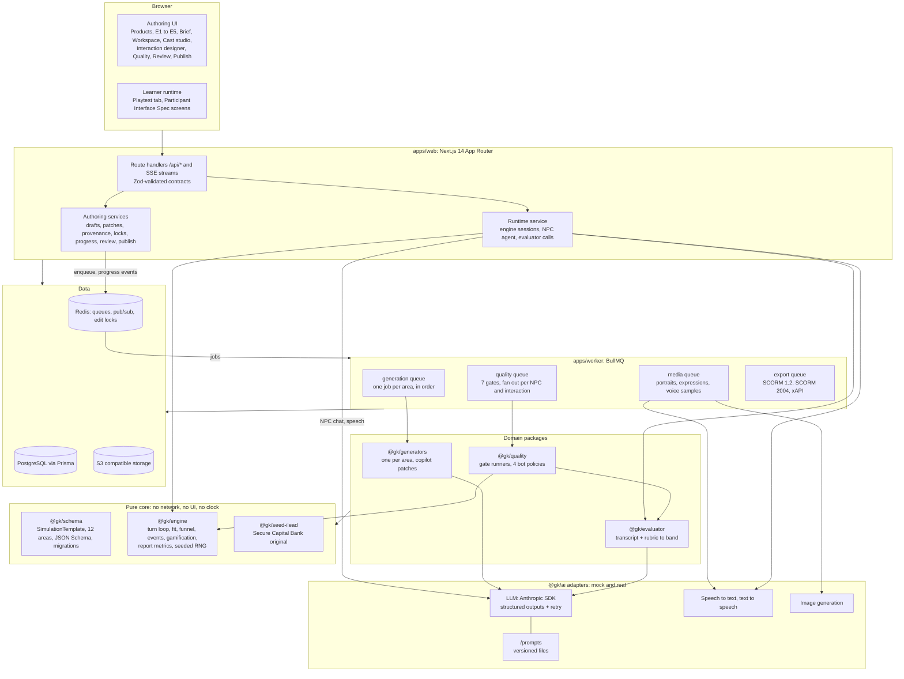
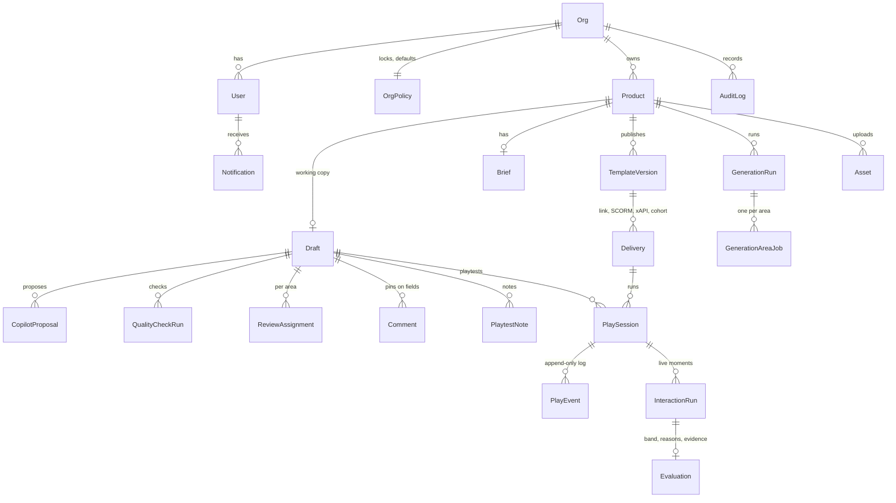
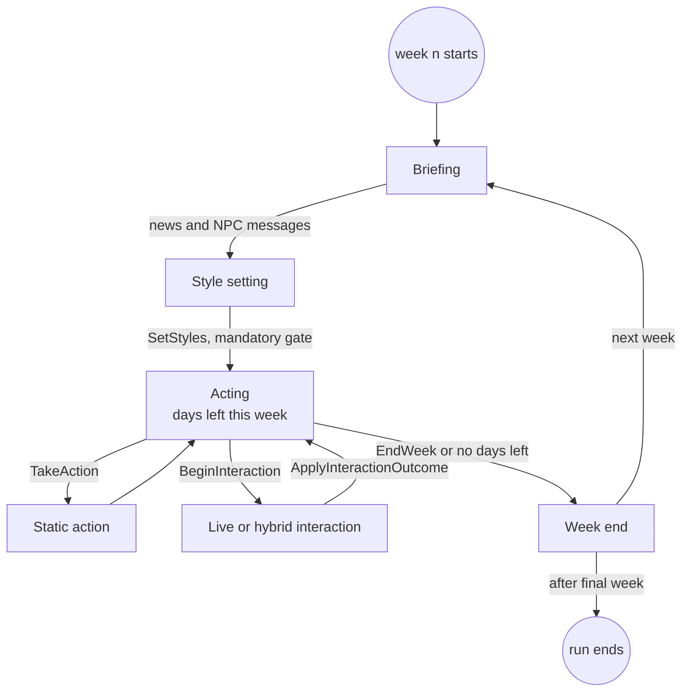
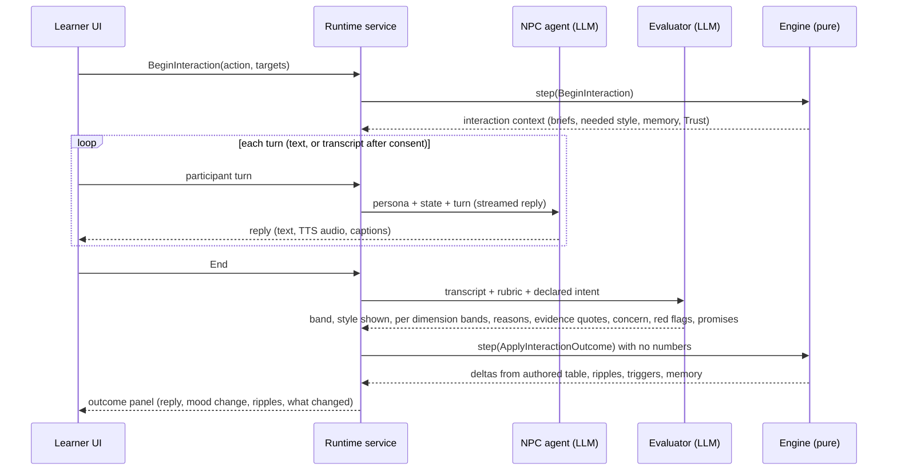

# iLead authoring in GenieKreator: build plan (M0)

As of 2026-10-01. Owner: lead engineer. Status: **M0 for review. No feature code yet.**

This plan turns the five spec docs into a milestone build: a Zod-validated SimulationTemplate covering all 12 configurable areas, a pure deterministic engine, provider adapters for every AI capability, BullMQ jobs for generation and quality gates, and the Next.js authoring journey from Products to Publish. Every product behaviour below cites a source doc; where the docs are silent I state an assumption (A-xx in `docs/decisions.md`) or ask a question (section 15).

## 0. Inputs and environment

**Source docs.** The repository was empty (no commits, no remote branches, no `/docs`). Two specs were uploaded as PDFs; I found all five as live Claude Docs owned by the requester and exported them verbatim to `docs/source/` (diagrams reconstructed as Mermaid). Live docs and PDFs match word for word.

| Priority | Doc | Repo copy |
| --- | --- | --- |
| 1 | GenieKreator Authoring Screens: iLead Business Simulation | `docs/source/GenieKreator Authoring Screens iLead Business Simulation.md` (+ PDF) |
| 2 | GenieKreator Configuration Spec: iLead Simulation | `docs/source/GenieKreator Configuration Spec iLead Simulation.md` (+ PDF) |
| 3 | iLead 2.0: AI Authored, Interactive Simulation Design | `docs/source/iLead 2.0 AI Authored Interactive Simulation Design.md` |
| 4 | iLead 2.0 Participant Interface Spec | `docs/source/iLead 2.0 Participant Interface Spec.md` |
| Ref | iLead Gameplay Teardown and GenieKreator Blueprint | `docs/source/iLead Gameplay Teardown and GenieKreator Blueprint.md` |

Also used, outside the priority list: the **GenieKreator Brand Guidelines** artifact (palette, gradients, Manrope type scale) and the two Products screenshots in the brief, for visual parity only.

**Environment checked.** Node 22.22, pnpm, PostgreSQL 16, Redis 7, Chromium for Playwright, and npm registry access are all available in the build container. No existing GenieKreator code exists, so the stack is the one named in the brief.

## 1. What we are building

An L&D author reaches iLead in 4 clicks (Experience, Simulations, Business Simulations, iLead), picks a start mode, answers an 8 question brief, waits about 3 minutes for AI generation, then refines 12 areas in one workspace with an AI copilot, playtests, runs 7 quality gates, gets each area reviewed, and publishes a version that appears in Products with results (Screens doc, Summary and Journey flow).

Everything a learner sees, hears or is scored on is data in one SimulationTemplate; the turn loop, state maths, evaluation pipeline, safety guardrails, data privacy and audit logging, and report formulas are a locked engine (Config Spec, "What is configurable vs locked").

Out of scope: the DILO builder itself (navigation card only), the AI RolePlays builder, the other 4E product lines (shown as tab content only), and production cohort delivery on the KNOLSKAPE platform beyond an adapter stub.

## 2. Architecture



**How each non negotiable rule is enforced**

| Rule (from brief) | Mechanism | How it is checked |
| --- | --- | --- |
| Everything is data | One `SimulationTemplate` Zod schema; UI forms, generators, engine, report and quality gates all import it from `@gk/schema`. JSON Schema exported at build time. | Snapshot test of exported JSON Schema; a settings inventory test asserts every Config Spec setting maps to a schema path |
| Locked engine | `@gk/engine` is pure TypeScript with a serialisable seeded RNG; it takes `(template, state, command)` and returns `(state, events)` | ESLint bans `Date`, `Math.random`, `fetch`, `node:*`, React and Prisma imports inside the package; determinism property tests |
| AI judges, rules decide | Evaluator returns only a band, style shown, concern surfaced, red flags, promises and evidence. The engine applies authored consequence tables for that band. | Engine `ApplyInteractionOutcome` command has no numeric stat fields; type test fails if one is added |
| Provider adapters | `LlmProvider`, `SpeechToText`, `TextToSpeech`, `ImageGenerator`, plus `Storage`, `Mailer`, `Moderation` interfaces with mock implementations selected by env | All unit and e2e tests run with `AI_PROVIDER=mock`; no keys in repo; `.env.example` lists names only |
| Structured outputs | `llm.generateObject(schema, prompt)` uses the SDK's structured output support, validates with Zod, retries with the validation error appended (max 2 retries), then fails the job with a typed error | Unit tests with a mock that returns invalid JSON first |
| Prompts are versioned files | `/prompts/<task>/<version>.md` with front matter (id, version, output schema name, purpose). Loader refuses inline prompt strings. | Lint rule: no template literal longer than 200 chars passed to `llm.*`; prompt registry test |
| Audio rules | Evaluator input type is `Transcript` (text turns only). Audio capture UI requires a stored consent record first. No emotion APIs exist in any adapter. | Type level: evaluator has no audio parameter; e2e: mic disabled until consent accepted |
| Report integrity | Every report element carries `trace: { kind: "engine", metric, eventSeqs } or { kind: "template", path }` | Unit test walks the report model and fails on any element without a resolvable trace |
| Accessibility | WCAG 2.2 AA; keyboard operable; visible focus; reduced motion | axe checks in every Playwright spec; keyboard-only journey spec; `prefers-reduced-motion` spec |

## 3. Package layout

pnpm workspaces, TypeScript strict (plus `noUncheckedIndexedAccess`), ESLint flat config, Prettier, Vitest workspace, Playwright.

```text
/
  apps/
    web/                    Next.js 14 App Router (authoring UI, learner runtime, /api route handlers, SSE)
      src/app/              routes (section 7)
      src/components/       design system (tokens from Brand Guidelines) and feature components
      src/server/           services: drafts, patches, provenance, locks, progress, review, publish, runtime
      src/i18n/en.json      all UI copy (checked by copy lint)
      e2e/                  Playwright specs and screenshot baselines
    worker/                 BullMQ worker process: generation, media, quality, export queues
  packages/
    schema/                 @gk/schema: Zod SimulationTemplate (12 areas), Brief, patches, provenance,
                            locks, API contracts, schema migrations, JSON Schema export
    engine/                 @gk/engine: pure deterministic engine and report metrics, seeded RNG
    seed-ilead/             @gk/seed-ilead: the iLead original (only place client content may live)
    ai/                     @gk/ai: adapter interfaces, mocks, Anthropic implementation, prompt loader
    generators/             @gk/generators: one generator per area plus copilot patch planner
    evaluator/              @gk/evaluator: transcript + rubric to band, reasons, evidence quotes
    quality/                @gk/quality: 7 gate runners and the 4 bot policies
    db/                     @gk/db: Prisma schema, client, repositories, test DB helpers
    export/                 @gk/export: SCORM 1.2, SCORM 2004, xAPI package builders (M9)
    sim-cli/                @gk/sim-cli: CLI that plays a full run (scripted or random policy)
  prompts/                  versioned prompt files, one folder per task
  fixtures/demo/            dev-only demo data (existing DILO product cards); never imported by packages
  scripts/                  copy lint, docs lint, JSON Schema export
  docs/                     plan, decisions, progress, source specs
  CLAUDE.md
```

Dependency direction is one way: `schema` has no internal deps; `engine` and `seed-ilead` depend on `schema`; `generators`, `evaluator`, `quality` depend on `ai`, `schema`, `engine`; apps depend on everything. `engine` never depends on `ai` or `db`.

## 4. Data model

### 4.1 SimulationTemplate (one object, 12 areas)

One versioned Zod object, `SimulationTemplate`, with `meta` plus one key per area. Areas and their editor groups follow the Screens doc (World, Rules, Experience and output). The Config Spec calls area 3 "NPCs"; the UI label is "Cast" (C-02). Settings marked ★ are new in iLead 2.0. Defaults are the "iLead default" column of the Config Spec and live in `@gk/seed-ilead`, not in the schema.

Two validation levels: `TemplateSchema` (structural, enforced on every save so drafts always parse) and `PublishableTemplateSchema` (cross-field rules: weights sum to 100, every live interaction has 2 to 4 rubric dimensions, 6 to 12 calibration samples, every skill has at least 2 observation points, every referenced id exists). Publishable issues surface as amber area status and as quality gate failures, never as save errors.

```ts
SimulationTemplate {
  meta: { templateId, schemaVersion, format: "ilead", engineVersion, title, subtitle, client, sourceTemplateId? }

  // WORLD
  context: {
    organisation: { mode: "real" | "fictional_twin" | "fictional"; name; tagline; industry; subIndustry;
      size; structure; ownership; region; city; officeType; values: {name, line}[] (max 6);
      competitors: string[] (max 5); businessSituation: "turnaround" | "growth" | "change" | "crisis" | "merger" | "new_launch";
      situationNote; glossary: {term, meaning}[]; policies: {kind: "hr" | "compliance" | "sales_conduct" | "other", text?, assetId?}[] }
    product: { lines: {id, name, description}[] (1 to 5); focusLineId; valueProposition; weaknesses;
      segments: {id, name, description}[] (max 4); unitOfValue: "revenue" | "units" | "accounts" | "nps" | "cases_closed" | "uptime";
      currency; numberFormat }
    scenario: { participantRoleTitle; level: "first_line" | "mid" | "senior"; span; backstory;
      sponsorNpcId; sponsorStyle: "supportive" | "demanding" | "distant"; welcomeMessage (rich text);
      tone: "formal" | "friendly" | "high_pressure" | "playful"; realism: "grounded" | "slightly_dramatised" | "high_drama" }
  }
  branding: {
    ownership: "knolskape" | "client" | "both"; logos: { main, light, icon: AssetRef };
    colours: { light: Palette; dark: Palette };          // primary, secondary, accent, status colours
    fonts: { heading: FontRef; body: FontRef }; loadingArt: AssetRef; endArt: AssetRef;
    artStyle: "photographic" | "illustrated_flat" | "illustrated_3d" | "line_art";
    backgrounds: Record<ScreenKey, SceneKind | AssetRef>; props: string[];
    portraitDefaultSource: "upload" | "stock" | "generated"; expressionSetDefault: "single" | "five";
    iconSet; imageSafety: { brandCheck, offensiveCheck, likenessCheck };   // locked on
    media: { sponsorWelcomeVideo: "none" | "avatar" | "upload"; introVideo: AssetRef?;
      ambientSound: "off" | "office" | "store" | "warehouse"; uiSounds: "off" | "subtle" | "game_like";
      music: "off" | "calm" | "upbeat" }
  }
  cast: {
    roster: { teamSize (4 to 16); membersPerRole (1 to 4, per stage override);
      supportingCast: ("sponsor" | "hr_partner" | "peer_manager" | "customers" | "candidates")[];
      archetypeMix: Archetype[];   // top_performer, low_performer, complainer, role_seeker, rival_hire, quiet_expert, new_joiner, near_retirement
      diversity: { mode: "mixed" | "mirror_workforce"; notes }; hiringPool: { count (0 to 6) } }
    npcs: Npc[]
    relationships: { id, a, b, type: "allies" | "rivals" | "mentor" | "friends" | "conflict" }[]
    rippleRules: { id, trigger: "rewarded" | "criticised" | "moved" | "fired" | "recognised";
      source: NpcSelector; affected: NpcSelector | "related_by:<type>" | "peers_outperforming_source" | "team";
      condition?: Expr; deltas: StatDeltas }[]
  }
  Npc {
    id; kind: "team_member" | "sponsor" | "candidate" | "customer" | "peer" | "hr";
    identity: { name, pronouns, ageBand };
    look: { portrait: AssetRef; attire; setting; accessories; expressions?: Record<Mood, AssetRef>;
      avatarMode: "static" | "animated" | "video" };     // Mood = neutral, happy, concerned, frustrated, thinking
    profile: { roleId; jobTitle; previousCompany; tenureMonths; experienceYears; skills: string[] (1 to 4);
      remarks; hiddenConcern: { text, linkedEventIds, linkedActionIds }; careerGoal; archetype };
    stats: { skill, morale, result (0 to 100); trust? (0 to 100) ★;
      roleFit: Record<roleId, { skill, motivation, performance }>;  // hidden; Assess reveals one cell
      sensitivity: { recognition, criticism, change, workload };     // multipliers on deltas from actions and events tagged with that category (A-22), default 1
      influence (0 to 100) };
    persona ★: { personality: { openness, assertiveness, warmth, resilience, candour } (1 to 5);
      communicationStyle: "direct" | "polite" | "verbose" | "terse" | "emotional" | "formal";
      attitudeToLeader: "supportive" | "neutral" | "sceptical" | "hostile";
      pressureResponse: "withdraws" | "argues" | "over_promises" | "escalates";
      openingLines: string[]; catchphrases: string[];
      knowledgeScope: { areas: ("own_work" | "team_gossip" | "customer_details" | "policy")[], notes };
      offLimitsTopics: string[]; memoryDepth: 3 | 5 | "all" };
    voice ★: { source: "library" | "licensed" | "none"; voiceId?; language; accent; pitch; pace; warmth;
      emotionalRange: "flat" | "moderate" | "expressive"; moodLinked; pronunciation: {word, phonetic}[];
      consentRecordId? };      // required when source is licensed or cloned
    candidate?: { trueProfile: { skill, morale, result, roleFit }; interviewPersona };
  }
  process: {
    type: "sales_funnel" | "service_flow" | "operations_line" | "project_delivery" | "custom";
    stages: { id, name, icon, tooltip, idealPerWeek, maxMembers, branchOf? }[] (3 to 7);
    workUnit: "lead" | "order" | "ticket" | "patient" | "case" | "task";
    throughput: { weights: { skill, morale, result }; referenceProductivity };   // engine default, balanced by gate
    bottleneck: { stageCapacity: boolean; carryOver: boolean };
    branching: { enabled: boolean };
    targets: { primary: { kind: "revenue" | "units" | "sla_pct" | "nps" | "cases_resolved"; value };
      valuePerUnit; secondary: ("team_skill" | "morale" | "attrition" | "quality")[] (max 3);
      kpiDials: ("skill" | "morale" | "result" | "trust" | "engagement" | "quality" | "safety")[] (3 to 5);   // all 7 defined in docs/scoring-and-report.md
      kpiLabels: Partial<Record<Kpi, string>>; weeklyDrift: { morale, result };
      winCondition: { kind: "hit_target" | "target_and_morale" | "best_score"; moraleFloor? } }
  }

  // RULES
  leadership: {
    framework: "ilead" | "situational_leadership" | "coaching_styles" | "client_upload";
    styles: { id, name, shortCode, definition, colour }[] (3 to 6);
    readinessBands: { id, label, skill: [min, max], morale: [min, max], trust?: [min, max] }[];
    fitMatrix: Record<bandId, styleId>;                  // needed style per band (match or mismatch only)
    memberExceptions: { npcId, week, styleId }[];        // also shown in the NPC "Stats and fit" tab (C-08)
    roleMisfit: { roleFitSkillBelow; strength: "none" | "moderate" | "strong" };   // semantics A-22
    deltaTable: Record<"match" | "mismatch", StatDeltas>;
    teamFeedback: Record<"below_half" | "half" | "majority" | "all", string[]>;
    inferenceRules ★: { styleId, indicators: string[] }[];
    intentVsAction ★: { enabled; gapWeeks; trustDelta };
  }
  actions: { catalogue: Action[] }
  Action {
    id; name; icon; description; group: "team" | "individual"; hidden: boolean;
    scope: "team" | "individual" | "multi_select"; mode: "static" | "hybrid" | "live";
    dayCost (0 to 3); cooldownDays; limits: { maxTargets?, maxUsesPerWeek?, maxUsesPerRun? };
    eligibility: EligibilityRule[];    // named, parameterised predicates: maxPerRole, minLeftInRole, peerCoversRole, availableOnly, teamNotFull
    prerequisites: { actionId, sameTarget, penalty: StatDeltas, nudge: boolean }[];
    effects: Effect[];                 // locked effect kinds: statDelta, swapRoles, reassignRole, makeUnavailable,
                                       // revealRoleFit, hireCandidate, removeMember, teamDelta, scheduleEvent
    options: { id, label, description, styleTag?, dayCost?, consequences: Record<"match" | "mismatch" | "any", StatDeltas>,
               quotes: Record<"match" | "mismatch" | "any", string[]> }[] (2 to 4);
    baseConsequences: { target: StatDeltas; rippleRuleIds: string[] };
    unlock: { kind: "always" | "from_week" | "after_event" | "sponsor_unlock"; week?; eventId? };
    interaction? ★: LiveInteraction;
  }
  LiveInteraction ★ {
    format: "email" | "chat" | "roleplay_1to1" | "team_meeting" | "sponsor_briefing" | "interview" | "written_plan";
    inputModes: "text" | "audio" | "both"; timeLimit: { minutes, stop: "soft" | "hard" }; turnLimit;
    participantBrief: { goal, context, showNpcCard }; npcBrief: { wants, fears, hides, willAccept };
    difficulty: "easy" | "standard" | "tough"; opening: { speaker: "npc" | "participant", line };
    rubric: { dimensions: { skillId, anchors: Record<Band, string> }[] (2 to 4);
      concernDetection: { phrases: string[] }; redFlags: { id, label, description }[];
      aggregation: "median_lower" };                  // A-05
    bandNames: Record<Band, string>;                  // Band = strong, adequate, weak, harmful
    consequences: Record<Band, { target: StatDeltas; bystanders: { selector, deltas }[]; sponsor: number }>;
    triggers: Record<Band, ({ kind: "followUpEvent", eventId } | { kind: "logPromise" } | { kind: "resolveConcern" } | { kind: "escalate", eventId })[]>;
    hints: { policy: "off" | "on_request" | "after_weak"; tips: string[] };
    calibrationSet: { id, text, kind: "text" | "audio_transcript", authorBand?, note?, source: "ai" | "pilot" }[] (6 to 12);
    email?: { recipientsAllowed, cc, bcc, attachments, replyAllReactions };
    meeting?: { attendees, agendaRequired, npcToNpc };
    interview?: { candidates, questionBank, hiddenTrueProfile };
  }
  events: { deck: Event[]; pacing: { perWeek: [min, max]; intensityCurve: number[] } }
  Event {
    id; type: "impact" | "signal" | "capacity" | "diagnostic" | "opportunity" | "crisis";
    theme: "change" | "competitor" | "reputation" | "personal" | "attrition" | "compliance" | "customer" | "market";
    trigger: { kind: "fixed", week, day? } | { kind: "random", weeks: [from, to], probability }
           | { kind: "conditional", condition: Expr, sustainWeeks? } | { kind: "action", actionId, band? };
    target: { kind: "team" | "role" | "npc" | "sponsor"; id? };
    delivery: "bulletin" | "modal" | "npc_chat" | "email" | "sponsor_call";
    title; body (rich text); image?: AssetRef;
    impact: { deltas: StatDeltas; capacityLossDays?; funnelChange?: { stageId, delta } };
    expectedResponse?: { actionIds: string[]; withinDays; reward: StatDeltas };
    responseWindowDays?; escalation?: { followUpEventId };
    repeat: { kind: "once" | "recurring" | "cooldown"; cooldownWeeks? }; showImpactLabel: boolean;
  }
  time: {
    playMode: "full" | "standard" | "lite" | "custom"; weeks (2 to 12); daysPerWeek (3 to 7); timeUnitLabel;
    liveCap: { perWeek; perRun?; excludeSponsorBriefings: boolean };
    realTimeLimit: { kind: "off" | "total" | "per_week"; minutes? };
    clockPauses: ("live" | "modals" | "reports")[]; saveResume: { enabled; windowDays? };
    sittings: { count (1 to 4); breakAfterWeeks: number[] };
    delivery: "self_paced" | "facilitated" | "cohort_sync";
    facilitatorControls: ("pause_cohort" | "inject_event" | "extend_time" | "reset_participant")[];
    practiceWeek: "none" | "guided_tour" | "week0";
  }

  // EXPERIENCE AND OUTPUT
  gamification ★: {
    elements: { score, stars, streaks, badges, sponsorMeter, unlocks, teamPulse, leaderboard, tiers: boolean };
    weights: { business, people, leadership } (sum 100); scale: { kind: "0_100" | "0_1000" | "custom"; max };
    liveBandScores: Record<Band, number>;              // 100, 70, 35, 0 from the Design doc L formula; editable per A-26
    stars: [number, number, number]; streak: { minStars, startWeeks, bonusPerWeek, cap };
    badges: { id, name, icon, copy, lockedHint, event, condition: Expr, count?, repeatable }[];
    sponsorMeter: { start; briefing: Record<Band, number>; weekRevenue: { above, below }; escalation };
    unlocks: { threshold; lowThreshold; lowPenaltyDays; rewards: { id, kind: "bonus_day" | "hire_budget" | "team_activity" | "custom", label }[] };
    tiers: { name, min }[] (2 to 5); leaderboard: { scope: "cohort" | "business_unit" | "global"; size; anonymous; window };
    celebrations: "none" | "subtle" | "full";
  }
  report: {
    sections: { id: ReportSectionId, enabled, order }[];     // the 10 Report 2.0 sections
    skillsFramework: { source: "ilead_default" | "knolskape_ontology" | "client_upload"; skills: { id, name, definition }[] };
    linkage: Record<skillId, InteractionKey[]>; minObservations;   // default 2
    ratingScale: { id, label, colour, minScore }[] (default 5);   // Novice to Role Model; level count is configurable
    anchors: Record<skillId, Record<levelId, string>>;
    narrativeBank: { section, band?, styleId?, levelId?, capabilityBand?, text }[];
    evidence: { perSkill; redactNames }; developmentPlan: { priorities; items: { skillId, practiceActivity, onTheJobAction, checkInDays }[] };
    audiences: ("participant" | "manager" | "ld_admin" | "cohort")[]; delivery: ("in_app" | "pdf" | "email" | "lms_record")[];
    branding: "same" | "report_specific"; humanReview: "off" | "sample_audit" | "full_review";
  }
  access: {      // UI label "Language and access"
    languages: { default; available: { code, status: "source" | "machine" | "reviewed" }[]; learnerPicks };
    mixedLanguagePlay; localeFormats: { dates, numbers, currency, nameOrder };
    accessibility: { captions, transcripts, keyboardOnly, screenReaderLabels, reducedMotion, highContrast, textSize };
    typedFallback: true;      // "Always available" in Config Spec, so a literal
    devices: ("desktop" | "tablet" | "mobile")[]; lowBandwidth: "auto" | "on" | "off";
    integrations: { lms: ("scorm12" | "scorm2004" | "xapi" | "lti" | "api")[]; sso: boolean };
    dataConsent: { audioConsentScreen; retentionDays?; transcriptStorage; storageRegion };
  }
  governance: {
    collaborators: { userId, role: "admin" | "author" | "reviewer" | "facilitator" | "viewer" }[];
    approval: { enabled; reviewersPerArea: Partial<Record<AreaKey, userId[]>> };
    locks: { path, lockedBy, reason }[];   // read only mirror of org policy locks for this build (A-23)
    versioning: { enabled }; templates: { enabled }; useDeclaration: "development" | "selection";
  }
}
```

Shared types: `StatDeltas = { skill?, morale?, result?, trust? }` (integers), `AssetRef = { source: "upload" | "stock" | "generated" | "builtin"; assetId?; alt; prompt? }`, `Expr` = a string in a small safe expression language (section 5.6).

**Settings inventory.** M1 adds `packages/schema/src/inventory.ts`: one row per Config Spec setting (about 205 across the 12 areas: Context 24, Branding 19, Cast 40, Process 15, Leadership 12, Actions 31, Events 14, Time 12, Gamification 11, Report 12, Language and access 9, Governance 6) with its schema path, default source and "AI generates" flag. A test fails if any row has no resolvable path.

### 4.2 Envelope: provenance, locks, versions

The engine reads only `SimulationTemplate`. Authoring metadata lives beside it, never inside it:

```ts
DraftDocument {
  template: SimulationTemplate;
  fieldMeta: Record<JsonPointer, {          // drives the AI badge
    source: "seed" | "ai" | "author";
    via?: "form" | "copilot" | "regenerate";
    generator?: { area, promptId, promptVersion, runId };
    by?: userId; at: ISODate }>;
  areaState: Record<AreaKey, { opened: boolean; reviewed: boolean; reviewedAt?; reviewedBy?; attention: string[] }>;   // A-29
  revision: number;                         // optimistic concurrency
}
```

- **AI generated vs author edited.** A field shows the AI badge while `source` is `ai`. Any author edit flips it to `author`. Regenerating a block whose fields include `author` values asks first and shows a before and after (Screens, System states).
- **Admin locks.** Locks are org policy (`OrgPolicy.locks: { path, lockedBy, reason }[]`; defaults: brand colours and skills framework per Config Spec). A locked path is rejected by the patch service with `LOCKED_BY_ADMIN`, rendered with a padlock and the admin's name, and offers Request change (notification to the admin). An area whose every editable path is locked shows a padlock in the rail.
- **Schema versioning.** `meta.schemaVersion` is an integer. `@gk/schema/migrations` holds pure `vN -> vN+1` functions; drafts migrate on read; published versions keep their original schema and engine version so results stay reproducible.
- **Draft vs published.** A product has one working draft. Publish freezes an immutable `TemplateVersion` (template JSON, schema version, engine version, version name, change note). Editing after publish continues on the draft; the live version is unchanged until the next publish.

### 4.3 Persistence (PostgreSQL via Prisma)



| Model | Key fields | Notes |
| --- | --- | --- |
| Org, User, Membership | role: admin, author, reviewer, facilitator, viewer | Breadcrumb "KNOLSKAPE" is the org name |
| OrgPolicy | locks, defaultSkillsFramework | Admin locks (Config Spec, Governance) |
| Product | kind (business_sim, dilo_sim, ...), format ("ilead"), title, client, description, status (draft, in_review, approved, published, archived), progressPct, lastAreaKey, liveVersionId | Products list cards; Continue Editing returns to `lastAreaKey` |
| Draft | template JSON, fieldMeta JSON, areaState JSON, revision | One per product |
| Brief | answers JSON (Zod `Brief`), strength | 8 questions |
| Asset | kind (org_chart, process_doc, values, product_sheet, brand_kit, policy, skills_framework, image, audio, video), storageKey, mime, extractedText, safetyStatus, consentRecordId | S3 compatible storage |
| GenerationRun, GenerationAreaJob | area, order, status (queued, running, done, failed), attempt, error, outputHash | Per area retry |
| CopilotProposal | prompt, patch (JSON Patch), before/after, status (pending, applied, dismissed) | Every AI change is reviewable |
| QualityCheckRun | gate, scopeId (npc or interaction), status (passed, failed, stale, not_run, running), inputsHash, result JSON | Stale when dependent paths change |
| ReviewAssignment, Comment | areaKey, reviewerId, decision; fieldPath, body, resolved | Review flow (P3) |
| TemplateVersion, Delivery | immutable template; kind (link, scorm12, scorm2004, xapi, cohort), cohort dates, facilitator, leaderboard scope | Publish (P4) |
| PlaySession, PlayEvent, InteractionRun, Evaluation, Transcript | seed, snapshot revision, engine state; seq, type, payload; band, styleShown, reasons, evidence | Playtest and later live runs |
| AuditSample | interactionRunId, assessorId, humanBand, note, status | Human review tier (Config Spec "Sample audit" default; Design doc ITC row "a human audit sample of AI scored interactions"); feeds Results "Interaction quality" and "Content health" |
| Participant, Enrolment | email or LMS learner id, consent record, delivery id; never an authoring user | Your answer to Q3: participants are a separate identity from authors and enter only through a share link, LMS launch or cohort invite |
| PlaytestNote, Notification, AuditLog | | |

Edit locks and presence live in Redis with TTL, not Postgres.

## 5. Engine design (`@gk/engine`)

### 5.1 Shape

```ts
createRun(template: SimulationTemplate, seed: string, opts?: { playtest?: boolean }): RunState
step(template, state: RunState, cmd: Command): { state: RunState; events: EngineEvent[] }
view(template, state): RunView           // what the learner UI may see (hidden values stripped)
debugView(template, state): DebugView     // playtest only: needed style, Trust, concern status, queue
report(template, state): ReportModel      // Report 2.0 with traces
gamify(template, state): GamificationView
```

Commands: `SetStyles`, `TakeAction`, `BeginInteraction`, `ApplyInteractionOutcome`, `ReplyToMessage`, `AcknowledgeEvent`, `ChooseUnlock`, `EndWeek`, and playtest-only `DebugJump`, `DebugTriggerEvent`, `DebugSetStats` (rejected unless the run was created with `playtest: true`).

Determinism: the RNG (sfc32, state stored in `RunState`) is split into named streams (`events`, `messages`, `quotes`, `bots`) derived from the seed so a new feature drawing random numbers does not shift unrelated outcomes (A-16). Same template, seed and command list always yield byte-identical state; a property test enforces it.

### 5.2 Turn loop (iLead 2.0 weekly loop, Design doc "Target gameplay flow")



What each step does: Briefing delivers the news bulletin, NPC messages, and scheduled and triggered events. SetStyles applies fit deltas and the team message. TakeAction spends days and applies cooldowns, limits, eligibility, prerequisites and ripples. ApplyInteractionOutcome takes the evaluator's band and applies the authored consequence table, triggers and memory. WeekEnd runs funnel throughput, drift, escalations, the promises check, stars, streak, sponsor meter, badges and unlocks. Modal interrupts (sick leave, complaints) are events with a `day` trigger or a random trigger evaluated at each day boundary.

### 5.3 Rules the engine implements (with source)

| Rule | Source | Engine behaviour |
| --- | --- | --- |
| Style fit by readiness band | Teardown hidden rule 1; Config Leadership | Needed style = fit matrix of the member's current band; member exceptions override; recomputed every week from current stats |
| Role misfit penalty | Teardown (Justin failed all styles); Config | If role fit skill for the current role is below threshold, "strong" makes every style a mismatch and "moderate" halves match gains (A-22: the docs give the effect, not the mechanism) |
| Delta table and team message | Teardown week table; Config | Match or mismatch deltas per member; team message picked by share of matches (below half, half, majority, all), variant chosen by RNG |
| Option scoring reuses style fit | Teardown hidden rule 2 | Static options with a style tag score match or mismatch against the needed style, not the event context |
| Day budget, costs, cooldowns, limits | Teardown catalogue; Config Actions | Energize 10 day cooldown; email max 3 recipients; training max 3; per option day cost |
| Eligibility | Teardown hidden rule 6 | Max 2 per role; at least 1 left in role after Fire; training only if a peer covers the role; unavailable members excluded |
| Prerequisites | Teardown hidden rule 3 | Swap without Assess applies the authored penalty; the drawer nudge is UI only |
| Role fit matrix | Teardown hidden rule 4 | Swap and reassign move a member's stats to their role fit values for the new role (A-12); Assess reveals one cell |
| Ripples | Teardown hidden rule 5; Design doc ripples | Authored ripple rules fire on rewarded, criticised, moved, fired; fairness ripple hits peers who outperform the recipient |
| Weekly drift | Teardown hidden rule 8; Config | Members not addressed by any action that week lose the drift amount (A-03) |
| Funnel throughput and bottleneck | Teardown hidden rule 9; Config Process | Stage capacity from the owners' weighted stats against ideal per week; WIP carries over; conversions times value per unit gives revenue; bottleneck = lowest capacity to ideal ratio |
| Events | Config Events; Teardown events | Fixed, random (probability), conditional (expression, sustained N weeks), action based; target team, role, npc, sponsor; impact, capacity loss, funnel change; expected response window; escalation chain; repeat rules |
| Trust, memory, promises | Design doc NPC state and ripples | Trust from consequence tables; intent vs shown style gap for N weeks costs Trust; promises logged by `logPromise` triggers are checked in week n+1 (A-04); memory keeps the last N interaction summaries for the NPC agent |
| Live interaction outcomes | Design doc evaluation pipeline steps 3 to 5 | Engine receives band, style shown, concern surfaced, red flags, promises; applies the authored consequence table for that band, bystander deltas, sponsor change and triggers |
| Live cap | Config Time; Design doc play modes | Per week and per run; sponsor briefings excluded (A-13) |

### 5.4 Default engine values (derived, pending Q1)

The Config Spec marks readiness bands, the fit matrix, throughput weights and base consequences as "hidden engine values" or "engine default". No doc gives the numbers. Unless you supply the real values (Q1), M1 seeds values derived from the Teardown, each tagged `provenance: "derived"` in the seed and listed in `docs/decisions.md`:

- **Readiness bands (A-11).** A 2 by 2 grid on Skill (threshold 50) and Morale (threshold 60) mapped to the 4 styles as in Situational Leadership: low Skill and low Morale need Directing; low Skill and high Morale need Guiding; high Skill and low Morale need Partnering; high Skill and high Morale need Entrusting. This reproduces the Teardown observations: Kent 30/22, Peter 10/15 and Beth 25/57 need Directing; Beth 25/73 does not (she needs Guiding, which explains her Week 1 miss); Green 89/56, Lowe 80/45 and Ruth 80/50 need Partnering; Jack 92/85 and Derick 70/71 need Entrusting. One caveat: Mandy is 40/62 right after the swap, which this model calls Guiding; her observed Directing fit (Coach at Week 3, Day 5) holds only because her Morale fell below 60 by then (training, two mismatched weeks, drift and the Week 3 news event), and by Week 4 her Skill is close to the 50 threshold. The thresholds are therefore a starting point for the balance gate, not a proven fit. The M2 report fixture is a hand labelled choice log fed to the report functions, not an engine replay.
- **Delta table (A-24).** Match +2 morale, +2 result; mismatch -1 morale, -1 result (Teardown "+2 to +3, -1 to -2"); tuned by the balance gate.
- **Funnel (A-25).** Ideal 3, 2, 1, 1, 1 per week; productivity = 0.4 Skill + 0.3 Morale + 0.3 Result; capacity scales with the owners' mean productivity against a reference and with how many owners are available. Tuned in M2 so the strong bot reaches $240,000 and Gold and the careless bot stays below target and in Bronze (Config quality gate).

### 5.5 Gamification and report formulas (Design doc, locked; inputs and weights configurable)

- **Leadership Score** = 9 × (0.3 B + 0.3 P + 0.4 L) + streak bonus, where B = min(100, revenue / target × 100); P = clamp(50 + Δ avg Morale + 0.5 × Δ avg Trust, 0, 100); L = 0.5 × style fit % + 0.5 × average live band (Strong 100, Adequate 70, Weak 35, Harmful 0). When the run has no live interactions, L = style fit % (A-06, implied by the worked example). Weights 30/30/40 are configurable. Worked example test: B 12.5, P 53, L 69 gives 9 × 47.25 = 425.25, displayed 425, tier Bronze.
- **Weekly stars**: week score = 0.5 × weekly style fit % + 0.3 × average live band + 0.2 × min(100, funnel output / weekly ideal × 100); with no live interaction that week the 0.3 moves to style fit. 1 star at 50, 2 at 70, 3 at 85.
- **Streaks**: 3 weeks in a row at 2 stars or more earns +25, then +25 per extra week, cap +100; a broken streak resets the counter at no cost.
- **Sponsor confidence**: starts 50; briefing band +20, +5, -10, -25; week revenue vs ideal +5 or -5; escalation to CEO -10. 70 or more offers one unlock; below 30 triggers a CEO check in costing a day.
- **Team Pulse**: mean of team Morale and team Trust. **Tiers**: Platinum 850, Gold 700, Silver 500, Bronze below 500.
- **Badges**: rules over the event log, `{ id, event, condition, count, repeatable }`, e.g. `{ "id": "read_the_room", "event": "week_end", "condition": "style_fit_count >= 9", "repeatable": false }`. All 10 default badges ship in the seed.
- **Report metrics (Teardown, confirmed)**: dominant style (most used across all style tagged choices); style share; contextual capability % = correct style tagged choices / all; intent vs style per member (intent = dominant weekly setting, ties listed; style = dominant style of individual actions with that member, "None" if none); attention per member (average Result, delta = final minus starting Result, actions taken). The average Result is taken as the mean of the member's Result sampled after each player action: the Teardown run had 11 actions and its figures are consistent with elevenths (Kent 464/11 = 42.18, Jack 1032/11 = 93.82), though other sample counts also fit at two decimals, so M2 confirms it against the event log (A-10).
- **Report 2.0 additions**: style used vs needed per readiness band (4 by 4 grid), intent vs action with one quoted example, skills profile on the 5 level scale with 2 evidence quotes per skill, key moments in SBI form from the event log, people trajectories, funnel vs ideal with bottleneck, conversation analytics (descriptive only), development plan from template copy mapped to the lowest skills, methodology page from template copy.

**Complete rules:** every dial (including Engagement, Quality and Safety), skill rating, game score, badge and report section is specified in `docs/scoring-and-report.md`, which takes precedence over this summary.

### 5.6 Expression language

Badge conditions and conditional event triggers use a tiny, safe expression language (identifiers from a whitelisted metric registry, numbers, comparisons, `and`, `or`, `not`, parentheses), parsed to an AST and evaluated without `eval`. Examples: `style_fit_count >= 9`, `member.morale < 30 for 2 weeks` (sugar for `sustainWeeks`).

### 5.7 CLI (`@gk/sim-cli`)

`pnpm sim run --template seed:ilead --seed 42 --policy strong|one-style|careless|random|script:path.json --weeks 8 --json`. Prints a weekly summary, final score, tier and report metrics; `--json` emits the full event log. Live interactions are resolved by the policy (strong bot picks Strong, careless picks Weak, random draws a band) since the CLI never calls an LLM.

## 6. AI layer

### 6.1 Adapters (`@gk/ai`)

| Interface | Methods | Mock | Real (env selected) |
| --- | --- | --- | --- |
| `LlmProvider` | `generateObject(schema, prompt, opts)`, `streamText(messages, opts)` | Deterministic: returns fixtures keyed by prompt id and input hash; a rule based fallback for evaluator and NPC chat | Anthropic official TypeScript SDK (`@anthropic-ai/sdk`); `client.messages.parse` with a Zod output format; streaming for NPC chat |
| `SpeechToText` | `transcribe(audio, lang)` | Returns the fixture transcript attached to the test audio | Vendor TODO(decision) (Q6) |
| `TextToSpeech` | `synthesize(text, voice)` | Short generated WAV tone, duration proportional to text | Vendor TODO(decision) (Q6) |
| `ImageGenerator` | `generate(prompt, style, n)` | Deterministic SVG portraits (initials, palette from seed) | Vendor TODO(decision) (Q6) |
| `Moderation` | `check(text)` | Keyword list | LLM classifier prompt |
| `Storage`, `Mailer` | put/get/sign; send | Local disk; console | S3 compatible client; SMTP |

Keys come only from env (`ANTHROPIC_API_KEY`, vendor keys).

**Model routing (your answer to Q6: the best model for each task, with token use managed at scale).** Each task reads its own env var; exact model ids live in deployment config, not in the repo. Every request checks the stop reason and has refusal fallback enabled.

| Task | Volume | Model family (current generation) | Effort | Env var |
| --- | --- | --- | --- | --- |
| Area generators, copilot patch planning, regenerate | Per build, low | Claude Opus | High for generators, medium for copilot | `LLM_MODEL_GENERATION` |
| Evaluator (band classification) | Every live interaction, high | Claude Sonnet; an interaction can be pinned to Claude Opus when it cannot reach the 85% calibration gate after rubric fixes | Medium | `LLM_MODEL_EVALUATOR` |
| NPC role play, sponsor briefing, interview candidates, test chat | Every turn, highest, latency sensitive | Claude Sonnet, streamed | Low | `LLM_MODEL_NPC` |
| Calibration sample writing, upload extraction, translation | Per build | Claude Sonnet, Batch API where not interactive | Medium | `LLM_MODEL_UTILITY` |
| Memory summaries, input moderation, NPC output safety check | Every interaction or turn | Claude Haiku | Low | `LLM_MODEL_FAST` |
| Persona test and content safety gate (judge) | Per quality run | Claude Opus, Batch API | High | `LLM_MODEL_JUDGE` |

**Token controls at scale**

1. Prompt caching on every stable prefix: persona per NPC, rubric and anchors per interaction, brief plus earlier areas per build.
2. Evaluate once per interaction, never per turn (Design doc risks table).
3. NPC memory as short summaries capped by `memoryDepth`, never full transcripts.
4. Hard limits: turn limit and time limit per interaction, max output tokens per task, live cap per week, and a per session token budget (configurable per org) that degrades gracefully to shorter replies before it stops.
5. Result cache for the evaluator keyed by hash of transcript, rubric, prompt version and model; calibration reruns reuse it.
6. Batch API (half price) for everything not interactive: persona tests, safety judging, calibration samples, translations, cohort re-scoring after a rubric change.
7. Metering: input, output and cached tokens logged per org, build, session and task; an admin cost view and alerts at configurable thresholds.
8. Per route effort settings, tuned against the calibration and persona gates rather than guessed.

**Structured output with retry.** `generateObject` sends the Zod schema as the output format, parses the response, validates with Zod, and on failure retries up to 2 times with the validation issues appended to the conversation. It also checks the stop reason before reading content (refusals and max tokens are typed errors, not parse errors).

**Determinism for the evaluator.** Current Claude models do not accept sampling parameters such as temperature, so "deterministic settings" means: pinned model and prompt version, outcome bands instead of raw numbers, structured output, evidence quotes verified as verbatim substrings of the transcript, a result cache keyed by hash(transcript, rubric, prompt version, model), and the 85% calibration gate.

**Prompt caching.** NPC persona context (persona, knowledge scope, off limits, memory) is a stable system prefix per NPC with a cache breakpoint; volatile state (current mood, this week's facts) goes after it.

### 6.2 Prompts (`/prompts`)

```text
prompts/
  generate/context/v1.md  generate/process/v1.md  generate/branding/v1.md  generate/cast/v1.md
  generate/time/v1.md  generate/leadership/v1.md  generate/actions/v1.md  generate/events/v1.md
  generate/gamification/v1.md  generate/report/v1.md  generate/access/v1.md  generate/governance/v1.md
  copilot/plan-patch/v1.md      copilot/suggest/v1.md
  evaluator/band/v1.md          npc/roleplay/v1.md        npc/persona-test/v1.md
  calibration/samples/v1.md     safety/moderation/v1.md   brief/extract-uploads/v1.md
```

Front matter: `id`, `version`, `outputSchema` (name exported by `@gk/schema`), `purpose`, `changelog`. Prompts also restate the copy rules for any generated user facing text, and generated copy is checked by the same copy lint (retry on violation).

### 6.3 Generators (`@gk/generators`)

One generator per area: input is the Brief, extracted upload text and all earlier areas; output is that area's Zod schema plus field meta marked `ai`. Generation order (Config Spec "Generation order and editing"; Screens B2 "World first, then Rules, then Experience and output"; A-01 for the four areas the Config list omits):

1. Context, 2. Process and targets, 3. Branding and media, 4. Cast, 5. Time and pacing, 6. Leadership model, 7. Actions, 8. Events, 9. Gamification, 10. Report, 11. Language and access, 12. Governance.

Regeneration scopes: whole simulation, one area, one NPC group (look, profile, stats, persona, voice), or one field. The mock generators derive output from the iLead seed with deterministic substitutions from the brief so the whole pipeline runs offline.

### 6.4 Evaluator (`@gk/evaluator`)



Output schema: `{ band, styleShown, dimensions: { skillId, band, reason, evidence: string[] }[], concernSurfaced, concernEvidence?, redFlags: { id, evidence }[], promises: { text, dueWeek? }[], reasons }`. Post rules (pure, in the evaluator package): any red flag forces Harmful; overall band = median of dimension bands rounded toward the lower band (A-05); evidence that is not a verbatim substring is dropped and flagged.

### 6.5 Safety guardrails (locked)

Participant input moderation before it reaches an NPC; NPCs answer abuse in role and end the interaction neutrally after repeats (Participant spec, system states); off limits topics and knowledge scope enforced in the NPC prompt and checked by the persona test; image safety (brand, offensive, real person likeness) on every generated or uploaded image; licensed or cloned voices blocked without a consent record; no facial or voice emotion inference anywhere.

## 7. Screens and API surface

### 7.1 Routes (pages)

| Spec ID | Screen | Route |
| --- | --- | --- |
| E1 | Products, Experience tab | `/products?tab=experience` |
| E2 | Simulations: choose a type (+ comparison sheet) | `/products/simulations` |
| E3 | Business Simulations catalogue | `/products/simulations/business` |
| E4 | iLead format page | `/products/simulations/business/ilead` |
| E5 | Start mode modal (+ duplicate picker) | modal on E4 |
| (out of scope) | Day in the Life (DILO) Simulations builder | `/products/simulations/dilo` (placeholder that links to the existing builder) |
| B1 | Brief | `/builds/[id]/brief` |
| B2 | Generating your simulation | `/builds/[id]/generating` |
| Workspace | Overview and 12 area editors | `/builds/[id]/workspace/[area]` (`overview`, `context`, `branding`, `cast`, `process`, `leadership`, `actions`, `events`, `time`, `gamification`, `report`, `access`, `governance`) |
| Cast studio | Board, Grid, Relationship map, NPC panel | `/builds/[id]/workspace/cast?view=board\|grid\|map&npc=<id>&tab=look\|profile\|stats\|persona\|voice\|relationships` |
| Live interaction designer | 5 steps + calibration | `/builds/[id]/workspace/actions/[actionId]/design?step=setup\|briefs\|rubric\|consequences\|calibrate` |
| P1 | Playtest (new tab, "Playtest, not scored") | `/play/[sessionId]` |
| P2 | Quality check | `/builds/[id]/quality` |
| P3 | Review (reviewer view) | `/builds/[id]/review` |
| P4 | Publish | `/builds/[id]/publish` |
| Results | Results view | `/products/[id]/results` |

### 7.2 API (route handlers, all bodies Zod-validated, contracts in `@gk/schema/api`)

| Area | Endpoints |
| --- | --- |
| Products and catalogue | `GET /api/products` (tab, type, q) · `POST /api/products` (start mode, title, client, sourceProductId) · `PATCH /api/products/:id` · `POST /api/products/:id/duplicate` · `POST /api/products/:id/save-as-template` · `POST /api/products/:id/archive` · `GET /api/catalogue/business` (theme, level, length, language, q) · `GET /api/catalogue/business/recent` · `POST /api/catalogue/:format/notify` |
| Brief | `GET\|PUT /api/builds/:id/brief` · `POST /api/builds/:id/uploads` (signed upload) · `POST /api/builds/:id/uploads/:assetId/complete` · `POST /api/speech/transcribe` (consent required) |
| Generation | `POST /api/builds/:id/generate` · `GET /api/builds/:id/generation` · `GET /api/builds/:id/generation/stream` (SSE) · `POST /api/builds/:id/generation/areas/:area/retry` |
| Draft and workspace | `GET /api/builds/:id/draft` · `PATCH /api/builds/:id/draft` (JSON Patch + baseRevision) · `POST /api/builds/:id/areas/:area/confirm` · `POST /api/builds/:id/regenerate` (scope) · `POST /api/builds/:id/copilot` (streamed reply + proposals) · `POST /api/builds/:id/proposals/:pid/apply\|dismiss` · `POST\|DELETE /api/builds/:id/edit-locks` · `GET /api/builds/:id/presence/stream` · `POST /api/builds/:id/lock-requests` |
| Cast studio | `POST /api/builds/:id/npcs` · `POST /api/builds/:id/npcs/:npcId/duplicate` · `DELETE /api/builds/:id/npcs/:npcId` · `POST /api/builds/:id/npcs/:npcId/portraits` · `POST /api/builds/:id/npcs/:npcId/expressions` · `GET /api/voices` (filters) · `POST /api/voices/sample` · `POST /api/builds/:id/npcs/:npcId/test-chat` (stream) |
| Interaction designer | `POST /api/builds/:id/interactions/:actionId/samples` · `POST /api/builds/:id/interactions/:actionId/calibrate` · `POST /api/builds/:id/interactions/:actionId/try` |
| Quality | `POST /api/builds/:id/checks/run` (all or one gate) · `GET /api/builds/:id/checks` · `GET /api/builds/:id/checks/stream` |
| Runtime | `POST /api/play/sessions` · `GET /api/play/sessions/:sid` · `POST /api/play/sessions/:sid/commands` · `POST /api/play/sessions/:sid/interactions/:iid/turns` (stream) · `POST /api/play/sessions/:sid/interactions/:iid/end` · `POST /api/play/sessions/:sid/debug` (playtest only) · `POST /api/play/sessions/:sid/notes` · `GET /api/play/sessions/:sid/report` |
| Review and publish | `POST /api/builds/:id/review` · `POST /api/builds/:id/reviews/:area/decision` · `GET\|POST /api/builds/:id/comments` · `POST /api/builds/:id/publish` · `GET /api/products/:id/versions` · `POST /api/versions/:vid/exports` · `GET /api/products/:id/results` |
| Notifications | `GET /api/notifications` · `POST /api/notifications/:nid/read` · `GET /api/notifications/stream` |

Errors use one envelope `{ error: { code, message, details? } }` with stable codes (`VALIDATION`, `LOCKED_BY_ADMIN`, `EDIT_LOCKED`, `REVISION_CONFLICT`, `NOT_FOUND`, `FORBIDDEN`, `PROVIDER_FAILED`).

### 7.3 Screen details carried into milestones

Smaller elements from the Screens doc, listed so none is lost: E4 sample report thumbnail that opens a preview (M3, rendered from the seed report model); B1 right column "What we will build" summary that fills as answers arrive, and the Save brief and exit button (M4); Products card description "AI drafted from the brief, editable" (M4); Overview time estimate and the Time and pacing "live estimate of learner minutes as settings change", computed by a pure estimator seeded from the Design doc pacing table (A-28, M5); top bar Submit for review disabled until checks pass (M5, M8); cast health "diversity mix against the brief" (M6); P4 cohort setup "language default" (M9).


## 8. Job design (BullMQ on Redis)

| Queue | Job | Concurrency | Retry | Output |
| --- | --- | --- | --- | --- |
| `generation` | `area:<key>` for one GenerationRun | 1 per run (ordered), many runs in parallel | 3 attempts, exponential backoff; Zod failures already retried inside `generateObject` | Area config + field meta written to the draft in one transaction; progress event |
| `media` | `portrait`, `expressions`, `voice-sample` | 4 | 3 | Asset rows; portrait events feed the B2 live peek |
| `quality` | `gate:<name>` with fan out (`calibration:<interactionId>`, `persona:<npcId>`) | 4 | 1 (a failing gate is a result, not an error) | QualityCheckRun rows |
| `export` | `scorm12`, `scorm2004`, `xapi` | 2 | 2 | Package in storage, signed download link |

- **Ordering.** A generation run is a chain: each area job enqueues the next on completion. Scenario title and sponsor line are published first (B2 live peek); cast portraits are fanned out to `media` as each NPC is created.
- **Failure.** A failed area marks itself failed with Retry and the chain continues. Later areas that depend on a failed area use the iLead seed values for the missing input and are flagged amber (A-08). Retry for one area re-runs only that area.
- **Idempotency.** Job ids are `run:<runId>:area:<key>:attempt:<n>`; writes check `GenerationAreaJob.status` so a duplicate delivery is a no-op.
- **Progress and notification.** The worker publishes to Redis channel `build:<id>`; the web SSE endpoint relays it. On run completion the worker writes a Notification (bell) and calls `Mailer` (email).
- **Balance test.** 4 bot policies × 50 seeds by default (configurable upward) on the pure engine inside the worker; results include the outcome spread per policy for the P2 table.
- **Stale marking.** Each gate declares the template paths it depends on (for example balance: cast stats, leadership, actions consequences, process, gamification thresholds; calibration: that interaction's rubric and samples). Every draft patch marks matching passed gates as Stale (Screens, System states).

## 9. Workspace mechanics

- **Autosave.** Each field change sends a JSON Patch with `baseRevision`. Disjoint concurrent patches are rebased; overlapping ones return `REVISION_CONFLICT` with the latest value. The top bar shows Saving or Saved.
- **Co editing.** Field level soft locks in Redis (30 second TTL, heartbeat while focused); other authors see the field locked with the editor's name; avatars in the top bar from the presence stream.
- **Copilot.** Plain language request goes to `copilot/plan-patch`, which returns a reply and proposals of JSON Patch ops restricted to unlocked paths. The server applies each proposal to a copy, validates with `TemplateSchema`, and stores before and after values. Apply writes with `source: "author", via: "copilot"` (A-09); Dismiss discards. Mic input goes through `SpeechToText` after consent.
- **Area status.** "Reviewed" and "needs attention" are stored separately (A-29). Reviewed becomes true once the author confirms the area or edits any field, and it is what the 70% progress part counts. The rail dot shows: padlock when fully admin locked; otherwise Amber when the area has attention reasons (publishable validation issues, a failed or stale gate pointing to it, a generation failure, a reviewer's change request); otherwise Green when reviewed; otherwise Grey.
- **Progress formula** (Screens, Products list): 70% × reviewed areas / 12 + 20% × passed gates / 7 + 10% × approved areas / 12, rounded to a whole percent (A-02: both the gate and the approval parts accrue per item). A gate with many instances (calibration per interaction, persona per NPC) passes only when all its instances pass.
- **Statuses.** Draft, In review (after Submit for review), Approved (all areas approved), Published (has a live version). After publish, further edits show an "Unpublished changes" note and restart review for the next version (A-14).

## 10. UI system

- **Tokens from the Brand Guidelines**: Deep Space `#0A081B` background, Surface 1 `#111029` for nav, Surface 2 `rgba(255,255,255,.04)` for cards, Electric Blue `#249DFF` (primary, active pill), Cyber Cyan `#43D6E8` (primary buttons such as Continue Editing), Mint Green `#00F2AD` (success, progress completion), Pale Lavender `#DEE9FF` text, 135 degree brand gradients, radii 8/12/16/pill, Manrope only (self hosted, no runtime font fetch), sentence case.
- **Layout parity with today's GenieKreator** (screenshots): breadcrumb top left, centred pill tabs (Evaluate, Educate, Experience, Enable), illustrated choice cards with an author perspective line, a "Products" section rule with search, product cards with type chip, description, progress bar with %, Created and Updated dates, Continue Editing and Preview, overflow menu.
- **Accessibility**: muted text at 62% lavender is used for body copy only where it meets 4.5:1; 40% faint is never used for text. Focus ring 2px Cyber Cyan with offset. Framer Motion animations wrap `useReducedMotion`. Every interactive element is reachable by keyboard in DOM order.
- **Copy**: every UI string lives in `src/i18n/en.json`; `scripts/lint-copy` fails CI on em or en dashes, a spaced hyphen used as punctuation, any form of "competenc", and misspellings of Business Simulations, Day in the Life (DILO) Simulations, iLead, AI RolePlay (the existing E1 card title "AI RolePlays" is whitelisted, C-09). Headlines are author side questions; buttons are verbs.
- **Other 4E tabs** show their product cards from your list (Evaluate: Conversation AI, Nano AI, PitchPerfect AI; Educate: AI Microlearn, Interactive Learn; Enable: AI Koach) as non functional placeholders.

## 11. Testing and CI

Tooling: Vitest (unit and integration, workspace mode, `fast-check` for properties), Playwright with `@axe-core/playwright` for e2e and accessibility, screenshot baselines per new screen. Integration tests run against a real local Postgres and Redis started by test setup. CI (GitHub Actions, added in M1) runs `pnpm typecheck`, `pnpm lint`, `pnpm lint:copy`, `pnpm test`, `pnpm e2e` with Postgres and Redis services.

| Milestone | Unit and integration | End to end (Playwright) | Exit check |
| --- | --- | --- | --- |
| M0 Plan | none (docs only) | none | Docs lint: no em or en dashes in `docs/plan.md`, `docs/decisions.md`, `docs/progress.md`, `CLAUDE.md` |
| M1 Config model | Seed parses with `TemplateSchema` and `PublishableTemplateSchema`; settings inventory resolves every row; JSON Schema snapshot; migration round trip; provenance flip on edit; lock rejection; patch validation rejects invalid ops; roster equals Teardown exactly (10 members, S/M/R) | none | `pnpm sim validate seed:ilead` passes |
| M2 Engine | RNG determinism (property); band fit including Beth Week 1 vs Week 4; Justin misfit; Energize cooldown 10 days; email max 3; training max 3 and peer cover; max 2 per role; min 1 after Fire; swap without assess penalty; reward ripple on Jack; drift; event triggers, windows, escalation; funnel bottleneck; Trust, intent gap, promises; stars incl. no live reweight; streak cap; sponsor meter and unlocks; all 10 badges; **report fixture: 45 style tagged choices gives Directing 29%, Guiding 13%, Partnering 36%, Entrusting 22%, capability 69% (31 of 45)**; **Leadership Score example 425, Bronze**; attention metric 42.18 and 93.82 | CLI smoke: full 8 week run for every policy completes; strong reaches target and Gold, careless stays below target and Bronze over 50 seeds | Coverage of `@gk/engine` at least 90% lines |
| M3 Navigation | Catalogue filter logic; product creation service | Products, Experience, Simulations, Business, iLead, Start building; comparison sheet; filters and search; coming soon Notify me; each start mode; new draft appears at 0%; keyboard only journey; axe clean | Screenshots match E1 to E5 tables |
| M4 Brief and generation | Brief strength meter; minimum answers (Q1, Q3, Q5); generator order; per area failure and retry; idempotent job delivery; notification written | Brief to Generate draft to live progress with cast peek to Overview banner "Draft ready. Review each area; nothing is published until you publish."; leave page and get notified; retry one failed area | Pipeline runs fully on mocks |
| M5 Workspace | Progress formula; stale marking map; rebase and conflict; lock enforcement; copilot proposal validation; regenerate over edits | Area rail statuses; AI badge clears on edit; autosave states; regenerate with diff; copilot Apply and Dismiss; padlock with admin name and Request change; two browser contexts co editing lock | All 12 editors match the Screens area table |
| M6 Cast studio | Cast health bar rules (every style needed by at least 2 people, archetype coverage, missing hidden concerns); relationship edits; voice filters | Board drag between stages; Grid filters and bulk regenerate; Relationship map draw and delete link; NPC panel 6 tabs; portrait options; voice sample plays; test chat | |
| M7 Interaction designer | Evaluator schema; red flag forces Harmful; median lower aggregation; evidence verbatim check; agreement % | 5 step designer with live preview; calibration labels, Check AI scoring, disagreements side by side, Try it yourself | Agreement gate at 85% |
| M8 Gates and Playtest | Each gate's pass rule; balance 4 × 50 runtime budget; linkage at least 2 per skill; contrast check | Run all checks with statuses and Fix links; playtest one full week; debug drawer; jump controls; pinned note shows in the workspace | Learner screens follow the Participant spec for one week |
| M9 Review and publish | Publish gate; immutable versions; SCORM manifest and xAPI statement validation | Reviewer assignment, comment pins, approve and request changes; publish with version note and delivery; success screen; Products card with Results | Full journey from Products to Publish and back |

## 12. Milestone deliverables

| Milestone | Builds | Depends on |
| --- | --- | --- |
| M1 | Monorepo scaffold, CI, `@gk/schema` (12 areas, inventory, JSON Schema, migrations, provenance, locks, patches), `@gk/seed-ilead`, `@gk/db` schema | Q1, Q2, Q7 answers or the recommended defaults |
| M2 | `@gk/engine` complete for static and live paths, gamification, report metrics, `@gk/sim-cli` | M1 |
| M3 | `apps/web` shell, design system, auth adapter, E1 to E5, Products list | M1, Q3, Q4 |
| M4 | `@gk/ai` (mocks + Anthropic), prompts, `@gk/generators`, `apps/worker`, B1, B2, notifications | M1, M3, Q6 |
| M5 | Workspace, Overview, 12 editors, copilot, autosave, locks, progress | M4 |
| M6 | Cast studio | M5 |
| M7 | Interaction designer, `@gk/evaluator`, calibration | M5, M2 |
| M8 | `@gk/quality`, Quality check page, learner runtime and Playtest | M2, M7 |
| M9 | Review, publish, versions, `@gk/export`, Products additions, Results with its five views (cohort overview, skills view, interaction quality, experience feedback, content health) and the human audit sample queue for assessors | M8 |

After each milestone: typecheck, lint, copy lint, unit and e2e tests, screenshots checked against the spec tables, `docs/progress.md` updated, commit, push, stop for review.

## 13. Risks

| Risk | Impact | Mitigation |
| --- | --- | --- |
| Hidden engine values unknown (Q1) | Seed may not reproduce today's iLead feel beyond the observed numbers | Derive from Teardown, tag as derived, tune with the balance gate, swap in real values when supplied |
| Config defaults for time contradict iLead 2.0 (C-05) | Full mode with a 20 minute limit would cut learners off at Week 4, as in the Teardown run | Follow the Config Spec as instructed and raise a Time and pacing warning in the workspace; decision D-05 |
| LLM nondeterminism in scoring | Same answer, different band | Bands, pinned prompts, verbatim evidence, result cache, calibration gate, optional majority vote |
| Scope size (12 editors, cast studio, runtime) | Milestones slip | Each editor is driven from schema metadata (labels, widgets, AI assist per field) so most editors are configuration, not bespoke code |
| Real vendors for speech and images undecided | M6 and M8 audio and portraits stay on mocks | Adapters are ready; vendor is a config change (Q6) |

## 14. Conflicts, open decisions, assumptions

Logged in `docs/decisions.md`: 14 conflicts resolved by doc priority (C-xx), 13 open decisions implemented as configurable with `TODO(decision)` (D-xx), and 29 assumptions where the docs are silent (A-xx).

## 15. Questions for you (answered 2026-10-01)

All seven were answered; the answers and what they change are in `docs/decisions.md`, "Your answers". The original questions are kept below for the record.

1. **Engine values (blocks M1 and M2).** Do you have the current iLead engine values: readiness band thresholds, fit matrix, delta tables, the full role fit matrix (10 members × 5 roles), the funnel throughput formula, and the action and event deltas? *Recommended if not:* I seed the Teardown-derived values in section 5.4, tagged as derived, and tune them with the balance gate.
2. **Trust in the seed (M1).** The Config Spec default for Trust is "Not used", but iLead 2.0 consequence tables, the People score, Team Pulse and badges all use Trust. *Strict reading:* Trust off in the seed. *Recommended:* Trust on at 50 for every member (the Config Spec's AI default), logged as conflict C-07.
3. **Sign in and integration (M3).** Is this a standalone app, or must it plug into the existing GenieKreator sign in and Products API? *Recommended:* standalone with a dev sign in, a seeded KNOLSKAPE org and users for each role, behind an auth adapter ready for SSO.
4. **Coming soon formats (M3).** Which formats should the Business Simulations catalogue show as coming soon (open decision D-02)? *Recommended:* catalogue entries are data; I seed neutral placeholders for the four other skill themes (sales, change, strategy, operations) until you name them.
5. **Report scale and skill integration (M7 to M9).** The docs name only the ends of the 5 level scale (Novice, Role Model) and do not say how interaction bands become a skill level. Some live interactions (Reward, Hire, Reply to NPC messages, Energize toast) have no column in the default linkage matrix. *Recommended:* placeholder names for levels 2 to 4, skill score = mean band score (100, 70, 35, 0) mapped to levels by configurable thresholds, and Reward linked to Recognition and fairness; the rest unlinked until you decide.
6. **Model and vendors (M4).** Which Claude model should be the default for generation, evaluator and NPC chat, and which vendors for speech to text, text to speech and images? *Recommended:* one model set by `LLM_MODEL` for all three to start (I will suggest one in chat), vendors deferred with mocks until M6.
7. **Extra KPI dials (M1 and M2).** The Config Spec lets authors pick Engagement, Quality and Safety dials, but no doc defines how the engine computes them. *Answered:* defined in full in `docs/scoring-and-report.md`.
