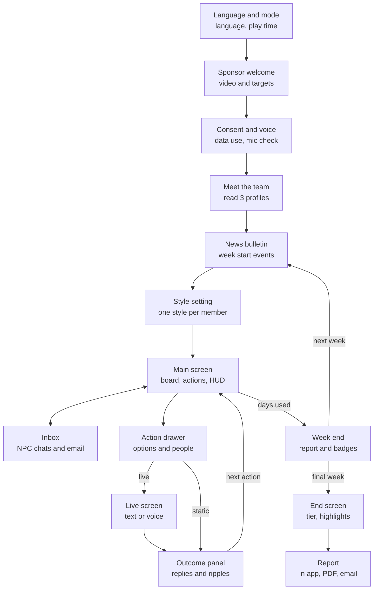

# iLead 2.0 Participant Interface Spec

> Source of truth: https://claude.ai/code/artifact/23a82f50-f6a5-4b85-aae1-488bec8d9412 (Claude Doc, exported 2026-10-01). Doc priority: 4. This file is a verbatim markdown export for search and review; if it ever disagrees with the live doc, the live doc wins. Do not edit by hand.

2026-10-01 · @Manu Nair

## Summary

This spec covers every screen a participant sees in iLead 2.0, from welcome to report, with text and voice input built into every live interaction. It keeps the current iLead structure the participant already understands (team board, actions panel, weekly loop), fixes the usability issues found in play, and adds screens for live interactions, NPC messages and gamification. Every label, image, colour and voice comes from the [GenieKreator configuration](https://claude.ai/code/artifact/1980cc27-e1df-4750-8b9e-59bd80400633), so one interface serves every client version.

**Design principles**

1. **Decide, then do.** Strategic choices stay one click; critical workplace moments open a focused live screen.
2. **One screen, one job.** Live interactions take the full screen with only the context the participant needs, so the team board does not compete for attention.
3. **Text or voice, always.** Every live screen has a mic button and a text box; the participant can switch mid interaction.
4. **Show consequences, not scores.** During play the participant sees reactions, mood and KPI movement; skill ratings appear only in the report.
5. **Never lose work.** Autosave on every action and every draft; resume on any device.
6. **Accessible by default.** WCAG 2.2 AA, captions, keyboard play, reduced motion.

**What changes from the current build**

| Area | Current iLead | iLead 2.0 |
|---|---|---|
| Member selection | Hover, then click, often missed | Single click or tap, with a clear selected state |
| Style setting | Dropdown menus that shift while opening | Segmented control on each card, plus a list view |
| Actions | Pick from 4 options | Static picks, hybrid flows, and live screens |
| NPC voice | Templated text quotes | Persona replies in text and voice |
| Clock | Runs during popups and reading | Pauses during live interactions and modals |
| Feedback | Big delta numbers on cards | Mood change, reply and short consequence summary |
| Gamification | Progress bar, leaderboard by conversions | Score, stars, streaks, badges, sponsor meter, tiers |

## Screen map

14 screens in three parts: a one time onboarding, a weekly loop around the main screen, and the close.

_Diagram reconstructed as Mermaid from the drawing embedded in the source doc. Labels are verbatim._

_Caption: screen map, 14 screens, weekly loop. Title on the drawing: "The main screen is the hub; every action returns to it"._

The inbox can open a live chat at any time; replying to an NPC costs no days but counts toward that NPC's state.

## Main game screen

The main screen is the participant's office. It has 5 zones, laid out for a 1440 by 900 desktop and reflowing for tablet.

| Zone | Position | Contents | Behaviour |
|---|---|---|---|
| HUD bar | Top, full width | Logo and title; Week x of 8 and Day; days left this week; real time clock (if on); Leadership Score; streak flame; settings and help | Clock shows a pause icon during live interactions; days left pulses when 1 day remains |
| Metrics strip | Under HUD | Team KPI dials (configurable, default Skill, Morale, Result, Trust); Team Pulse; target progress (for example $30,000 of $240,000); sponsor confidence meter | Each dial shows the latest change for 3 seconds, then a trend arrow |
| Team board | Centre | Stage header row with stage names and live counts; one column per stage, member cards stacked in each | Stage header turns amber when it is the bottleneck this week |
| Actions panel | Right | Team actions, then individual actions; each shows day cost, a live or static icon, cooldown or lock state | Disabled actions explain why on hover or tap ("Cooldown: 6 days left") |
| Inbox | Left drawer, collapsible | NPC chat messages, emails, news cards, sponsor notes; unread badges | New NPC message slides in with the portrait; urgent items pinned on top |

**Top level navigation (icons in HUD)**

| Item | Opens |
|---|---|
| Objective | Targets, win condition, scenario recap |
| Tutorial | Replayable guided tour and short video |
| Funnel | Stage by stage view: this week, all time, ideal |
| History | Timeline of every action and outcome, filterable by member |
| Leaderboard | Cohort ranking, if switched on |
| Badges | Badge shelf, earned and locked |
| Help | Controls, voice tips, support contact |

## Onboarding

Onboarding takes about 5 minutes and ends with the participant meeting the team. The clock does not start until onboarding is complete.

| # | Screen | Contents | Rules |
|---|---|---|---|
| 1 | Language and mode | Choose language; see play mode and expected time (for example "About 100 minutes, you can pause and resume") | Shown only if more than one language is configured |
| 2 | Welcome from the sponsor | Sponsor portrait, avatar video or letter; three tabs: Welcome, About the product, Your targets | Next is enabled after the video ends or after 10 seconds |
| 3 | Consent and data use | What is recorded (text, voice transcripts), why, retention, who sees the report | Must accept to use voice; text only play stays available if declined |
| 4 | Voice setup | Mic permission, 5 second test phrase with live transcript, speaker test with a sample NPC voice | Skip to text only at any time; can return from Settings |
| 5 | How to play | 4 card carousel: the weekly loop, static vs live actions, the clock, how you are evaluated | Replayable from Tutorial |
| 6 | Meet the team | Team board with profiles to open; prompt to read at least 3 | Proceed unlocks after 3 profiles, as today |
| 7 | Optional Week 0 | One practice chat with a friendly NPC, not scored | Shown only if configured |

## Team member card and profile

**Card on the team board (about 230 by 160 px)**

| Element | Detail |
|---|---|
| Portrait | Shows the current mood expression (neutral, happy, concerned, frustrated, thinking) |
| Name and role | Name; job title under it |
| Stat dials | Skill, Morale, Result; Trust as a small ring around the portrait. Hidden until the profile is first opened, as today |
| Style chip | This week's style, editable in style setting |
| Status tags | Training, Leave, Sick, New hire, Notice period; greyed card when unavailable |
| Signals | Speech bubble icon for an unread message; promise icon when a commitment is due this week |
| Selection | One click or tap selects; selected cards get a 2 px accent border and a check; a second click deselects |

**Profile panel (opens on click, 3 columns as today)**

| Column | Contents | New in 2.0 |
|---|---|---|
| Profile | Portrait, stats, style, previous company, tenure, experience, skills, remarks | Trust, career goal (once revealed), relationships with other members |
| Your interactions | Timeline of every action, event and outcome with deltas | Transcripts and drafts from live interactions; promises made and their status |
| Take an action | Every individual action for this person | Live actions marked with a voice and text icon and their duration |

Hidden concerns are never shown as text. Once a conversation surfaces one, a line appears in the profile ("Shared: feels his role is not what he was promised").

## Weekly style setting

Opens at the start of every week, before any action. It replaces the current dropdowns, which shift as they open and caused wrong selections in play.

| Element | Detail |
|---|---|
| Sponsor prompt | One line, as today ("To each his own..."), with a link to style definitions |
| Card view | Each card shows a 4 segment control under the stats (D, G, P, E with full names on hover); one tap sets the style |
| List view toggle | Table with one row per member: portrait, stats, last week's style and reaction, 4 radio buttons. Faster for keyboard and screen readers |
| Last week reference | Small tag on each card: last style and whether the reaction was positive or negative |
| Optional rationale | One line text or voice note per member ("Kent is new and unsure") that feeds the Intent vs action insight |
| Unavailable members | Still settable; note that the style applies when they return |
| Summary and confirm | Table of all 10 choices; Go back or Confirm, as today |
| Result | Team message from the sponsor plus mood changes on cards; deltas visible on tap |

## Static and hybrid action flow

Every action opens in a right side drawer, so the team board stays visible for selecting people.

1. **Choose the action** from the actions panel or a profile. The drawer shows the description, day cost and any limits ("up to 3 people", "needs a peer in the same role").
2. **Choose an option** for static actions (for example Team lunch or Team building). Options are radio cards with a short description.
3. **Select people** on the board with one click each. Ineligible cards are dimmed with the reason on hover ("Only member left in Qualify").
4. **Confirm.** A summary line states what will happen and the day cost ("Send Mandy, Justin and Peter to a 1 week workshop. 2 days.").
5. **Hybrid only:** after confirming, a live screen opens to communicate the decision (swap conversation, recognition note, exit conversation). The decision is locked; the conversation shapes the outcome.
6. **Outcome** appears in the notification panel (see Outcomes).

**Prerequisite nudges:** if the engine has a prerequisite (Assess before Swap), the drawer shows a soft warning with a one click shortcut ("You have not assessed Justin for Conversion. Assess first, 1 day?"). The participant can still proceed, and the penalty applies. Authors can switch nudges off, since skipping the step is part of what the simulation teaches.

## Live interaction screens

All 7 formats share one shell, so participants learn it once.

**Shared shell**

| Zone | Contents |
|---|---|
| Header | Format and person ("1:1 with Kent Goldberg"), timer with the pause state, End button |
| Brief card (left, collapsible) | Your goal for this moment, what you know about the person, their current mood, open promises, your declared style for them |
| Stage (centre) | The format specific workspace (table below) |
| Input bar (bottom) | Text box, mic button, send; mode switch at any time |
| Hint button | Optional, if the author allows hints; one coaching tip per interaction |

**Voice controls**

| Control | Behaviour |
|---|---|
| Mic modes | Push to talk (default) or open mic with automatic turn detection |
| Live transcript | Words appear as spoken; the participant can edit before sending in email, chat and plan formats |
| NPC voice | Plays with captions on; replay button on every NPC turn |
| Interrupt | Speaking while the NPC talks stops the NPC, as in a real conversation |
| Fallback | If the mic fails or audio is poor, a banner offers text and keeps the conversation intact |

**Per format workspace**

| Format | Workspace | Ends when | Special elements |
|---|---|---|---|
| Email composer | To, CC, subject, body; recipient chips from the team | Send | Dictate button per field; replies arrive in the inbox over the next sim day |
| Chat | Thread view like Teams or Slack | Participant closes or NPC signs off | Voice notes; typing indicator for NPC |
| 1:1 AI RolePlay | NPC portrait or animated avatar, mood ring, transcript under it | Time limit, End button, or natural close | Mood ring shifts subtly with the conversation, no scores shown |
| Team meeting | Grid of attendee portraits, active speaker highlight, agenda box | Time limit or End | Raise hand from quiet NPCs; participant can call on someone by name |
| Sponsor briefing | Sponsor avatar; optional 3 bullet notes area the participant fills first | Sponsor ends Q&A | Funnel and KPI snapshot pinned for reference |
| Interview | Candidate portrait, CV card, question notes | Time limit or End | Compare view after 2 interviews, then Hire or Pass |
| Written plan | Form: goals, measures, owner, due day, support needed | Submit, followed by a 2 minute check in | Fields accept dictation; the NPC comments on the plan in the check in |

After any live screen ends, a 3 second transition shows "The team is reacting" while evaluation runs, then returns to the main screen with the outcome.

## Outcomes, events and interrupts

**Outcome panel (top of the main screen, as today, redesigned)**

| Element | Detail |
|---|---|
| Headline | What happened, in one line ("Kent opened up about what is bothering him") |
| Reply | The NPC's reply in their voice, with replay; avatars of everyone affected, tap to read each reaction |
| Movement | Mood change on each affected card plus KPI arrows; exact numbers on tap, not as large overlays |
| Ripples | "Jack noticed" style line when a bystander reacted |
| What changed | Up to 2 lines of consequence ("Kent's leads will flow to Beth again"); never the rubric band name |
| History link | Opens the full entry in History |

**Events and interrupts**

| Type | Delivery | Participant controls |
|---|---|---|
| News bulletin | Card carousel at week start with illustration; See impact on each card | Next, previous, Proceed |
| NPC message | Chat in the inbox with portrait and preview | Reply now (opens chat), later, or ignore; due day shown |
| Email | Inbox item with a reply button | Reply opens the email composer |
| Modal interrupt | Centre dialog for leave, complaints, urgent sponsor notes | Acknowledge, or respond if the event needs a reply |
| Sponsor call | Incoming call banner for escalations | Take the call (opens briefing) or schedule within 1 day |

The clock pauses while any modal or event card is open.

## Week end, gamification and end screen

**Week end sequence**

1. End of week banner with Proceed.
2. Weekly report: funnel this week vs ideal, KPI start, change and end, stars earned (1 to 3), streak status, sponsor confidence change.
3. Badge popups for any badge earned this week, one at a time, skippable.
4. Unlock offer if sponsor confidence crossed a threshold (choose one reward).
5. Next week news bulletin, then style setting.

**Gamification surfaces**

| Element | Where it lives | Interaction |
|---|---|---|
| Leadership Score | HUD, with a tooltip that explains the 3 inputs | Opens a breakdown of Business, People, Leadership |
| Stars | Weekly report and History | Hover shows the week score |
| Streak flame | HUD | Counter with next bonus |
| Badges | Popup when earned; shelf from HUD | Locked badges show the hint, not the rule |
| Sponsor meter | Metrics strip | Tap shows recent causes |
| Leaderboard | HUD icon, refreshes live | Top 10 plus own rank; anonymous if configured |

**End screen**

| Element | Detail |
|---|---|
| Headline | Tier earned (Bronze to Platinum) and Leadership Score |
| Results row | Target achieved, conversions, final Team Skill, Morale, Result, Trust |
| Highlights | 3 best moments and 1 moment to revisit, each one line with the week |
| Badges | All earned badges |
| Report | View report in app, download PDF, email to self |
| Reflection | Optional 2 question reflection (text or voice) that feeds the development plan |
| Feedback | 1 to 5 rating and comment on the experience |

## States, accessibility and devices

**System states every screen must handle**

| State | What the participant sees |
|---|---|
| Evaluating | "The team is reacting" transition, under 5 seconds target; skeleton outcome panel if longer |
| NPC slow to reply | Typing or thinking indicator; after 8 seconds, a retry option |
| Mic blocked | Banner explaining how to allow the mic, plus Continue in text |
| Poor audio | "We did not catch that" with the partial transcript to edit or resend |
| Connection lost | Draft kept locally; actions queue and retry; clock paused |
| Session resumed | Recap card: week, day, last 3 outcomes, open messages |
| Out of days | Actions panel locks; End week is the only primary button |
| Time limit reached | Gentle 2 minute warning, then end screen; live interaction in progress is allowed to finish |
| Inappropriate input | NPC responds in role; repeated abuse ends the interaction with a neutral message and is logged |

**Accessibility (target: ****[WCAG 2.2 AA](https://www.w3.org/TR/WCAG22/)****)**

- Captions on every NPC voice line and video; transcripts saved in History.
- Full keyboard play: tab order follows HUD, team board, actions, inbox; shortcut keys for mic and send.
- Screen reader labels on every card, dial and chip; list view for style setting.
- Colour is never the only signal: moods also change the portrait and label; deltas carry + and - signs.
- Reduced motion setting turns off card overlays, celebrations and pulsing.
- Text size up to 200% without loss of content.
- Voice is never required: every live interaction can be completed in text.

**Devices**

| Device | Support |
|---|---|
| Desktop and laptop, 1280 px and wider | Full experience |
| Tablet, landscape | Full experience; team board scrolls by stage |
| Mobile | Lite mode and resume only; live interactions in chat and voice work, team board becomes a list |

## Fixes from the current build and themable elements

**Issues seen in play, and the fix**

| Issue in current iLead | Fix in 2.0 |
|---|---|
| Style dropdowns shift while opening, causing wrong picks | Segmented control and list view |
| Member selection needs hover then click | Single click select with a clear selected state |
| Clock keeps running during popups and tour steps | Clock pauses in tours, modals, events and live screens |
| Tour popovers reappear on top of dialogs | Tour runs once per area, never over an open dialog |
| Large red and green overlays hide faces and stats | Mood change and small deltas; details on tap |
| "No impact on result" labels while morale still drops | Labels removed; See impact always shows true effects |
| Same quote for every trainee | Persona replies per NPC |
| Action panel clicks sometimes open a member profile instead | Separate hit areas; drawer opens beside the board, not over it |
| Report download opens a separate file with no in app view | In app report plus PDF and email |

**Themable from GenieKreator, with no design work**

| Element | Source setting |
|---|---|
| Logos, colours, fonts, light and dark | Branding |
| Backgrounds, illustrations, icons | Images |
| NPC portraits, expressions, avatars, voices | NPCs |
| Stage names, KPI names, time unit label | Process, targets, time |
| Action names, icons, descriptions | Actions |
| Badge names, icons, tier names | Gamification |
| All copy, in every configured language | Language |
